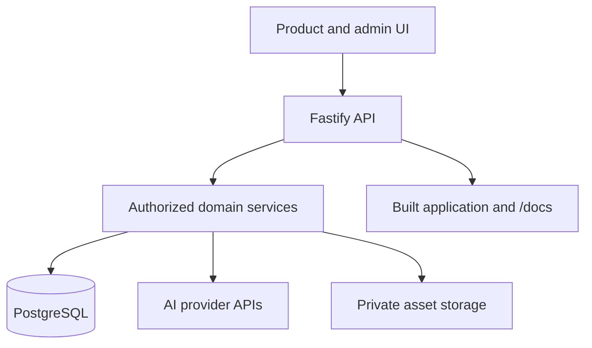

# Technical architecture

**Source review:** 9 September 2026. This page describes the application checkout. Deployment availability and paid provider behavior require separate operational checks.

## Current implementation

| Layer | Current source |
| --- | --- |
| Application | React 19 / Vite; `src/studio/` and shared design-system components |
| Campaign modules | `src/studio/campaign/`; six module hosts and a coordinator |
| HTTP API | Fastify; `server/app.js`, `server/bootstrap.js`, `server/start.js` |
| Business rules | Services and shared contracts; `server/services/`, `shared/` |
| Persistence | PostgreSQL migrations and repositories; `server/db/`, `server/repositories/` |
| Providers and files | Provider adapters, existing generation-job control plane, memory/test and Google Cloud Storage adapters |
| Documentation | VitePress 1.6.4, Markdown and Mermaid |

This is broader than the original browser-only prototype. Demo modes still exist, but they are not the complete application architecture.

The diagram shows existing module relationships; it is not a production topology or availability guarantee.

## Existing product data

Users, campaigns, generation jobs, compositions, assets, immutable campaign versions, review events and deliveries already have database records. Application-managed brand design systems have separate versioned records and assets.

Campaigns currently represent banner-oriented projects. Existing file records do not, by themselves, provide a general editable document model for decks and websites. See the [proposed data boundaries](/decisions/admin-data).

Review services and database gates control approval of exact versions. The admin workflow editor cannot override those rules.

## Proposed workflow extension

The recommendation is one backend codebase with separately runnable API and worker processes. Versioned workflow data drives supported capabilities; PostgreSQL persists runs, node attempts, questions and scheduling intent.

The dedicated configurable workflow worker, generic document foundation and admin data tables are planned additions. The existing canvas is built on React Flow and remains a preview.

See [Product logic designer](/decisions/asset-workflows) and [Delivery stages](/decisions/delivery) for scope and verification gates.

## Build and hosting

The current `Dockerfile` uses Node 22, includes FFmpeg, serves the built UI and docs through the Node application, exposes port 8080, and defines a health check. This replaces the earlier documentation's assumption that Nginx serves the production application.

`npm run build` builds the application and these docs into `dist/` and `dist/docs/`. The existing `docker-compose.yml` supplies PostgreSQL for development; it is not the proposed complete production deployment.

Production configuration currently expects PostgreSQL, Firebase authentication, Gemini configuration and Google Cloud Storage. Hosting on a rented server can retain those external services. A storage-provider change would require an adapter/configuration change.

A live public deployment or selected cloud region was not verified in this documentation update. [Hosting options](/decisions/hosting) records the alternatives under discussion.

## Keep implementation and documentation aligned

Update contracts and tests when behavior changes. Record source inspection separately from tests, load measurements and deployment checks. A diagram, provider adapter or Dockerfile does not establish a working production integration.
