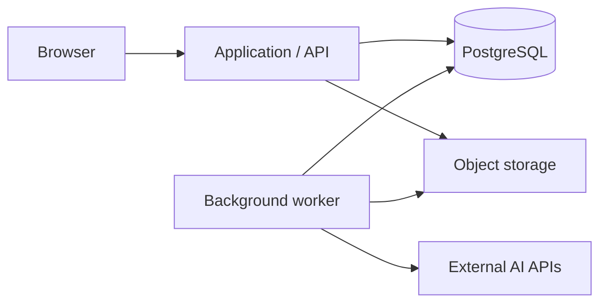

# Hosting options

**Status:** Explored; provider, region and budget remain open. **Updated:** 9 September 2026.

## What needs to run

The recommended architecture has an HTTP application, a durable background worker, PostgreSQL and private object storage. The same backend serves the product and admin.

API and worker are separate processes from one codebase. They can initially share a host. A closed browser must not stop queued work.

## Options explored

| Option | What it optimizes | Responsibility and limitation |
| --- | --- | --- |
| Managed Google Cloud | Lower infrastructure maintenance and separate scaling | Several services and usage-based charges |
| Rented VM + managed PostgreSQL/storage | Predictable compute cost with less database administration | We maintain the VM, containers and worker recovery |
| Single rented server including PostgreSQL | Lower initial service count and potentially lower bill | Database backup/restore and shared-host failure are ours to manage |
| Physical dedicated server | Sustained heavy rendering and predictable hardware | Fixed capacity is paid for even when idle |

Google Cloud fits the existing Firebase, Gemini and Google Cloud Storage integrations. That is a compatibility observation, not a provider selection.

For the managed option, Cloud Run can host the HTTP application and a worker pool can handle continuous background work. Worker pools need their instance count managed; they do not automatically make the application's queue durable. [Cloud Run worker pools](https://docs.cloud.google.com/run/docs/deploy-worker-pools)

## Starting resource estimates

These are planning estimates for light usage, not measured requirements.

| Component | Managed starting allocation |
| --- | --- |
| Application/API | 1 vCPU, 2 GB RAM |
| Worker | 2 vCPU, 4 GB RAM; initially limit heavy rendering concurrency |
| PostgreSQL | 2 vCPU, 8 GB RAM |
| Files | Private object storage with retention appropriate to assets |

For a rented VM hosting application and worker while PostgreSQL remains managed, the discussion considered roughly **4–8 vCPU and 16 GB RAM**. Resize from actual CPU, memory, queue-age and rendering measurements.

AI generation through external APIs does not require our own GPU. More server capacity helps local rendering and parallel work; it does not reduce external provider fees.

## Dedicated versus virtual

A VPS is a virtual machine; a physical dedicated server reserves the whole host. A dedicated-vCPU VM is a third option with reserved CPU resources. Shared resources are useful for variable workloads; dedicated resources suit sustained demand. [Hetzner resource comparison](https://www.hetzner.com/cloud/)

The cost-focused recommendation was to start with a rented VM for application/workers, retain external storage, and use managed PostgreSQL for customer data. Physical dedicated hardware is worth revisiting when sustained load justifies it. The earlier fully managed proposal prioritized maintenance effort.

Reference quotes checked during the 8–9 September discussion, for Germany/Finland:

| Example | Server-only monthly price | Setup |
| --- | --- | --- |
| Hetzner CPX42 virtual server | €69.49 | Check order |
| Hetzner AX42-1 dedicated server | €97.30 | €49 |

The quoted list excludes VAT and IPv4. Backups, external storage, database services, AI, traffic charges where applicable, and operating time are additional. Recheck current pricing before ordering; these are not total project budgets. [Official price list](https://docs.hetzner.com/general/infrastructure-and-availability/price-adjustment/)

## What must be configured

- Domain, HTTPS, service identities and controlled secret access.
- Private database access, automated backups and a tested restore.
- Health checks, error reporting, queue monitoring and spending alerts.
- Database migrations as a controlled release step.
- Worker shutdown/recovery and bounded rendering concurrency.

Managed backup configuration still needs verification. [Cloud SQL backups](https://docs.cloud.google.com/sql/docs/postgres/backup-recovery/backups)

The current Dockerfile and local PostgreSQL Compose service are useful starting points. The generic workflow worker and complete production deployment have not been implemented by this discussion.

Next: [Terraform and CLI setup](/decisions/infrastructure).
