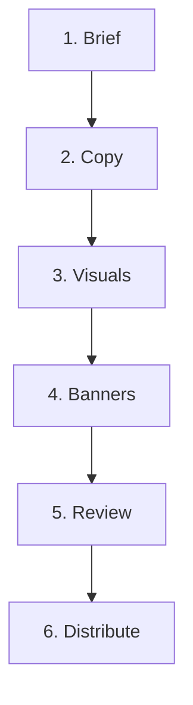

# Banner creation

[Product recipes](/workflow) · **Status:** Existing campaign flow plus persisted recipe authoring and simulation; live recipe runtime planned.

Turn a campaign brief into a reviewed banner set, using the selected templates and design system managed in the application.

::: info New product direction — 10 September 2026
The [campaign flow specification](/recipes/campaign-flow) defines five steps, with selection, Figma design/approval and final files as three states inside Banners. It includes Mermaid diagrams, conditions, recovery cases and the migration plan. The six-module flow below describes the current implementation; the new flow is not yet implemented.
:::

[Open Product recipes →](http://127.0.0.1:5181/mvp/admin/recipes?demoRole=admin#admin-product-recipes) — select **Banner creation**. Save, validate, simulate and publish its definition. Simulation uses fixtures; existing campaign generation remains separate.

## Inputs and outcome

**Inputs:** campaign goal, audience, channels and sizes, source copy, mandatory claims, template and published brand context.

**Outcome:** an approved immutable banner version, its PNG package and manifest. Requested sizes, required wording and content fit must pass the applicable checks.

## Current creation flow

The application uses six modules. Each block keeps its own draft, loading state and errors while the page connects the workflow. Older eight-step links still resolve to the matching module.

| Step | Current functionality grouped here |
| --- | --- |
| Brief | Paste a description or attach a file; analyze it and refine the summary and facts |
| Copy | Review the first five options, approve options, remove options, or generate more |
| Visuals | Prepare prompts; explicitly generate images or upload them, then select a visual |
| Banners | Select designs and output sizes; validate their content before preparing review files |
| Review | Prepare an immutable version, add the Figma review link and designer checks, request changes or approve |
| Distribute | Build and download the approved version's PNG package and manifest |

Each module owns its functionality and state, receives defined inputs, and provides defined outputs. Modules support independent development and debugging. See [Campaign modules](/campaign-modules) for development boundaries and test commands.

Brief analysis prepares the first Copy options and text-only visual prompts. Images are generated only after an explicit action. The connected Figma plugin can import a queued banner handoff and return reviewed artwork; older campaigns also support manual Figma linking. Current approval requires the returned artwork. Distribution does not yet publish to advertising platforms.

## Clarification points

The configurable recipe should ask only when a missing choice affects the result: which channel and size, which brand system, whether copy may be rewritten, and which claims or legal lines must stay verbatim. Preserve choices already supplied by the user.

The initial saved recipe asks for brief, channels, dimensions and mandatory copy when absent. Its simulation graph does not replace the complete six-module campaign implementation or its review gates.

## Review and delivery

Distribution requires an approved version. Revised creative needs another review round; approved versions retain their original content. Grouping review and approval into one module does not remove the existing review gates.

Recipe configuration must preserve these backend requirements. See [Product logic designer](/decisions/asset-workflows) for the shared model.
