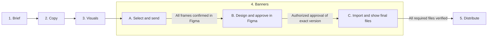

# Campaign creation flow {#campaign-creation-flow}

**Product specification · 10 September 2026 · Target behavior, not yet implemented**

[Open the editable campaign diagrams in FigJam](https://www.figma.com/board/x8hF9FnWADFI4KLSui41r0/Project-X?node-id=11-484) — start with the revised horizontal Brief → conditions → Copy sequence. Earlier whole-campaign diagrams remain as reference. Mermaid is the versioned source; agreed board changes must be applied here explicitly.

The campaign has five steps: **Brief → Copy → Visuals → Banners → Distribute**. Banners contains selection, Figma design review and approval, and the returned final files. Review is no longer a separate step.

This specification records the requested product direction and proposes the conditions needed to make it reliable. The current application still has six modules and returns Figma artwork **before** approval. The diagrams below describe the new flow; they are not evidence that it already runs.

## Campaign at a glance {#campaign-overview}

Diagrams retain readable text at their natural size. Scroll inside a diagram to follow longer branches; keyboard users can focus the diagram and use the arrow keys.

The three states are layouts of the same Banners block, not new wizard steps. A status control beside **Banners** shows progress. Automated job statuses are read-only; the control offers only the human transitions that the current user may perform. The campaign header and progress rail read the same server state.

## Brief → conditions → Copy {#brief-copy-flow}

Read **Step 1: Brief → transition conditions → Step 2: Copy** horizontally, then continue through [Visuals, Banners and Distribute](#remaining-campaign-flow). Each step owns its internal decisions; separate condition panels guard movement into the next step or Banners state.

[Open the horizontal sequence in FigJam](https://www.figma.com/board/x8hF9FnWADFI4KLSui41r0/Project-X?node-id=11-484). Pan right to continue through the three connected panels. The earlier whole-campaign diagrams remain on the board as reference.

Blue nodes are actions, yellow diamonds are mandatory checks, red branches show edge cases and recovery, and green nodes are saved outputs. Follow the main path left to right. Recovery cards use left-aligned headings and bulleted actions. They name the node to return to instead of drawing long crossing return arrows. IDs are shared with FigJam. The documentation displays fixed-layout SVGs generated from the Mermaid source below. After changing the diagram sources, run `node scripts/render-campaign-logic.mjs` before building the docs.

The rules below are **proposed product requirements**. They do not claim that the current implementation already enforces these guards. Reviewing the brief does not introduce a separate campaign Review step.

### Step 1 — Brief {#brief-step-logic}

Turn source material into a reviewed, saved brief. [Open this panel in FigJam](https://www.figma.com/board/x8hF9FnWADFI4KLSui41r0/Project-X?node-id=11-484).

Scroll right to follow the main path. [Open full diagram](/diagrams/brief.svg) · <a href="/docs/diagrams/brief.mmd" download>Download Mermaid source</a>

Mermaid source — Step 1 — Brief

<!-- campaign-logic:brief -->

~~~text
---
config:
  flowchart:
    useMaxWidth: false
    nodeSpacing: 70
    rankSpacing: 100
---
flowchart LR
  b1["B1  Enter or resume Brief text / file + brand context"]
  b2{"B2  Source readable and usable?"}
  b3{"B3  Analysis access ready?"}
  b4["B4  Analyze brief One explicit request"]
  b5{"B5  Valid analysis for current source?"}
  b6["B6  Review facts Refine and save brief"]
  b2x["Unreadable / empty source Unsupported, corrupt or protected file. Keep draft; replace file or paste text. Return to B1."]
  b3x["Access / quota dependency Check configuration and capability without generation. Restore access or wait Recheck B3."]
  b4x["Provider job dependency Keep source. Reconcile unknown request first. Retry confirmed failure only, at B4."]
  b5x["Invalid / stale analysis Missing facts, blocked response or changed source. Clarify at B1; reanalyze current version."]
  b6x["Brief persistence dependency Edits invalidate dependent analysis. Reanalyze at B4 if facts changed. Save failure: stay at B6."]
  b1 --> b2
  b2 -->|"Yes"| b3
  b3 -->|"Yes"| b4
  b4 -->|"Result"| b5
  b5 -->|"Yes"| b6
  b2 -->|"No"| b2x
  b3 -->|"No"| b3x
  b4 -->|"Failed / unknown"| b4x
  b5 -->|"No"| b5x
  b6 -->|"Refine / save fails"| b6x
  classDef action fill:#C2E5FF,stroke:#3DADFF,color:#1E1E1E
  classDef decision fill:#FFECBD,stroke:#FFC943,color:#1E1E1E
  classDef success fill:#CDF4D3,stroke:#66D575,color:#1E1E1E
  classDef recovery fill:#FFCDC2,stroke:#FF7556,color:#1E1E1E
  class b1,b4 action
  class b2,b3,b5 decision
  class b6 success
  class b2x,b3x,b4x,b5x,b6x recovery
~~~

Output: saved brief revision + reviewed facts + source/brand identities. Optional facts can remain unknown; unresolved facts required for copy block the transition.

### Transition — Brief to Copy {#brief-copy-transition}

Every check must pass before a new copy request can start. [Open this panel in FigJam](https://www.figma.com/board/x8hF9FnWADFI4KLSui41r0/Project-X?node-id=14-684).

Scroll right to follow the main path. [Open full diagram](/diagrams/brief-to-copy.svg) · <a href="/docs/diagrams/brief-to-copy.mmd" download>Download Mermaid source</a>

Mermaid source — Transition — Brief to Copy

<!-- campaign-logic:brief-to-copy -->

~~~text
---
config:
  flowchart:
    useMaxWidth: false
    nodeSpacing: 70
    rankSpacing: 100
---
flowchart LR
  g1["G1  Request copy Using reviewed brief"]
  g2{"G2  Saved, current and sufficient?"}
  g3{"G3  Text access and quota available?"}
  g4{"G4  New request needed?"}
  g5["G5  Save input snapshot Queue one copy job"]
  g2x["Context dependency Unsaved brief, stale analysis or missing required facts / brand rules. Resolve in Brief; return to G1."]
  g3x["Provider dependency Cached health + supported text model. No key, access denied or rate limit: fix / wait, then G3."]
  g4x["Duplicate-request protection Running / unknown: reconcile same job. Completed: reuse saved results at C4. Never resend on refresh."]
  g5x["Atomic handoff dependency Revision changes or queue persistence fails: no new provider call. Reload saved state; return to G1."]
  g1 --> g2
  g2 -->|"Yes"| g3
  g3 -->|"Yes"| g4
  g4 -->|"Yes"| g5
  g2 -->|"No"| g2x
  g3 -->|"No"| g3x
  g4 -->|"No"| g4x
  g5 -->|"Conflict / save fails"| g5x
  classDef action fill:#C2E5FF,stroke:#3DADFF,color:#1E1E1E
  classDef decision fill:#FFECBD,stroke:#FFC943,color:#1E1E1E
  classDef success fill:#CDF4D3,stroke:#66D575,color:#1E1E1E
  classDef recovery fill:#FFCDC2,stroke:#FF7556,color:#1E1E1E
  class g1 action
  class g2,g3,g4 decision
  class g5 success
  class g2x,g3x,g4x,g5x recovery
~~~

Snapshot binds brief revision, analysis, brand rules and generation intent. An intentional new batch gets a new request identity; repeated clicks share one job.

### Step 2 — Copy {#copy-step-logic}

Generate options, keep successful work, and choose what moves forward. [Open this panel in FigJam](https://www.figma.com/board/x8hF9FnWADFI4KLSui41r0/Project-X?node-id=11-646).

Scroll right to follow the main path. [Open full diagram](/diagrams/copy.svg) · <a href="/docs/diagrams/copy.mmd" download>Download Mermaid source</a>

Mermaid source — Step 2 — Copy

<!-- campaign-logic:copy -->

~~~text
---
config:
  flowchart:
    useMaxWidth: false
    nodeSpacing: 70
    rankSpacing: 100
---
flowchart LR
  c1["C1  Generate five copy options"]
  c2{"C2  Response valid and current?"}
  c3["C3  Save copy batch Bound to input snapshot"]
  c4["C4  Review and edit Select copy options"]
  c5{"C5  At least one valid copy selected?"}
  c6["C6  Copy ready Next: Visuals conditions"]
  c1x["Generation failure Keep brief + existing copy. Reconcile timeout; retry only confirmed failure through G1."]
  c2x["Invalid / partial result Blocked, malformed, stale or missing required wording. Repair via G1. Partial only: explicitly accept valid subset → C3."]
  c3x["Storage dependency Do not mark an unsaved batch ready. Recover the same job result at C3; no new generation."]
  c4x["Iteration path More options: new intent through G1. Brief edit: return to B1; keep copy as drafts and revalidate."]
  c5x["Selection dependency Nothing selected, invalid edits or stale copy. Return to C4; correct and select. No tailored visuals requested yet."]
  c1 -->|"Result"| c2
  c2 -->|"Yes"| c3
  c3 -->|"Saved"| c4
  c4 -->|"Continue"| c5
  c5 -->|"Yes"| c6
  c1 -->|"Failed / unknown"| c1x
  c2 -->|"No"| c2x
  c3 -->|"Save fails"| c3x
  c4 -->|"More / upstream edit"| c4x
  c5 -->|"No"| c5x
  classDef action fill:#C2E5FF,stroke:#3DADFF,color:#1E1E1E
  classDef decision fill:#FFECBD,stroke:#FFC943,color:#1E1E1E
  classDef success fill:#CDF4D3,stroke:#66D575,color:#1E1E1E
  classDef recovery fill:#FFCDC2,stroke:#FF7556,color:#1E1E1E
  class c1,c3,c4 action
  class c2,c5 decision
  class c6 success
  class c1x,c2x,c3x,c4x,c5x recovery
~~~

Output: selected copy IDs + edited revisions + source snapshot. N selected copies request N tailored visuals. Universal visual exploration uses the brief independently.

### Exact transition contract

**B6 → G1:** saving a reviewed brief makes Copy available; it does not prove that an AI request can run. Any initial creation action that also requests copy must still execute G1–G5. Do not regenerate just because the user opens Copy.

**G2:** require a persisted campaign and brief revision, usable source, an analysis that matches that source, and resolved facts/rules required for the requested copy. Keep optional unknowns explicit. If a brand system is selected, its required rules must be accessible; never silently substitute another brand. Output dimensions needed only for final banner handoff do not block early copy exploration.

**G3:** use configured server-side text access, a supported model and a recent non-generating connection check. Health checks do not guarantee the subsequent call will succeed. Recheck eligibility before dispatch, respect provider retry timing and never loop on rate limits.

**G4–G5 → C1:** atomically bind the source revision, reviewed analysis, brand revision and generation intent to one durable job. Repeated clicks use the same request identity. An intentional additional batch has a new intent. Resolve active or uncertain work before another provider call. If the source changes between validation and saving the job, reject the transition and reload the current brief.

**C2–C3 → C4:** validate the expected five-option batch, required fields and mandatory wording, then persist it against the captured input. Empty, blocked, malformed, incomplete or stale responses cannot mark Copy ready. Preserve usable partial work as drafts; let the user explicitly accept a validated subset or retry the failed work without discarding existing options. A completed batch is reusable at C4 only after persistence; an available but unsaved result resumes at C3.

**C5 → C6:** at least one selected option must be saved, valid after edits and tied to the current brief/brand context. A brief change preserves previous work as drafts but invalidates its readiness until revalidated. C6 exposes the next transition into Visuals; it never starts image or video generation itself. This selection gate applies to the copy-dependent route. Campaign-wide visual exploration may use the current brief independently through VG1–VG5.

### Critical dependencies and recovery

| Point | Edge case or dependency | Required behavior |
| --- | --- | --- |
| B2 | Empty text; unsupported, corrupt, password-protected or unextractable attachment | Keep draft and explain extraction failure; replace the file or paste readable text at B1. |
| B3 / G3 | Missing server configuration, revoked access, unsupported model, exhausted free-tier quota | Stop before generation; fix configuration or wait, then recheck. No credential appears in the UI or diagram payloads. |
| B4 / C1 | Timeout, disconnect or ambiguous provider acknowledgement | Reconcile the existing job; a timeout alone is not permission to resend. |
| B5 / G2 / C2 | Source or brand changes while work is running | Preserve prior result as a draft; it cannot become current automatically. Re-enter the transition using the new revision. |
| B6 / G5 / C3 | Saving state or queuing a job fails | Remain at the owning step. Retry persistence using the same result/job; do not regenerate to repair a storage error. |
| G4 | Double-click, browser refresh, reconnect or resume | Reuse the existing request and reconcile its status; no duplicate charge or generation. |
| C2 | Blocked, empty, malformed, incomplete or noncompliant copy | Show the failure and retain prior valid work. Validate any accepted subset explicitly; do not silently call an incomplete batch complete. |
| C4 | More options requested; brief edited after copy exists | More options re-enter G1 with a new generation intent. Brief changes return to B1 and require dependent-copy revalidation. |
| C5 | Zero selection, unsaved edits or stale selected options | Keep selection visible; correct and save at C4. Do not enter Visuals conditions yet. |

## Visuals → Banners → Distribute {#remaining-campaign-flow}

Continue horizontally through each step and the conditions that connect it. Banners A, B and C are states of one Banners section. There is no separate Review module.

| From | Transition passes when | Next |
| --- | --- | --- |
| Copy or universal brief exploration | Captured scope is current; route available; one operation persisted | Visuals |
| Visuals | Current copy / visual pairs, complete output requirements, valid compositions | Banners A |
| Banners A | Correct current receipt confirms every expected Figma frame | Banners B |
| Banners B | Authorized approval binds the current saved ready version and durable export intent | Banners C |
| Banners C | Approved manifest and every required stored file are verified | Distribute |

### Transition — Copy to Visuals {#copy-to-visuals-logic}

Validate the chosen route before any image or video request. [Open this panel in FigJam](https://www.figma.com/board/x8hF9FnWADFI4KLSui41r0/Project-X?node-id=16-154).

Scroll right to follow the main path. [Open full diagram](/diagrams/copy-to-visuals.svg) · <a href="/docs/diagrams/copy-to-visuals.mmd" download>Download Mermaid source</a>

Mermaid source — Transition — Copy to Visuals

<!-- campaign-logic:copy-to-visuals -->

~~~text
---
config:
  flowchart:
    useMaxWidth: false
    nodeSpacing: 70
    rankSpacing: 100
---
flowchart LR
  vg1["VG1  Choose route Tailored / universal / upload"]
  vg2{"VG2  Scope current and valid?"}
  vg3{"VG3  Route available?"}
  vg4{"VG4  New request needed?"}
  vg5["VG5  Capture scope Start one media operation"]
  vg2x["Source dependency Tailored: N valid selected copies. Universal: current brief. Upload: declared media purpose. Resolve scope; return to VG1."]
  vg3x["Capability dependency AI: supported model, access and quota checked without generation. Upload: type / size supported. Fix route; recheck VG3."]
  vg4x["Duplicate protection Reconcile running or unknown job. Reuse completed, stored media at V4. A new explicit scope gets a new job."]
  vg5x["Snapshot dependency Capture copy / brief revisions, media type and quantity. If changed or not persisted: no call. Reload and return to VG1."]
  vg1 --> vg2
  vg2 -->|"Yes"| vg3
  vg3 -->|"Yes"| vg4
  vg4 -->|"Yes"| vg5
  vg2 -->|"No"| vg2x
  vg3 -->|"No"| vg3x
  vg4 -->|"No"| vg4x
  vg5 -->|"Conflict / save fails"| vg5x
  classDef action fill:#C2E5FF,stroke:#3DADFF,color:#1E1E1E
  classDef decision fill:#FFECBD,stroke:#FFC943,color:#1E1E1E
  classDef success fill:#CDF4D3,stroke:#66D575,color:#1E1E1E
  classDef recovery fill:#FFCDC2,stroke:#FF7556,color:#1E1E1E
  class vg1 action
  class vg2,vg3,vg4 decision
  class vg5 success
  class vg2x,vg3x,vg4x,vg5x recovery
~~~

Tailored mode requests N visuals for N captured selected copies. Universal mode requests five directions and does not require copy selection. Uploads make no AI call. Video is always explicit.

### Step 3 — Visuals {#visuals-logic}

Acquire media, verify each result, and build usable copy / visual pairings. [Open this panel in FigJam](https://www.figma.com/board/x8hF9FnWADFI4KLSui41r0/Project-X?node-id=16-231).

Scroll right to follow the main path. [Open full diagram](/diagrams/visuals.svg) · <a href="/docs/diagrams/visuals.mmd" download>Download Mermaid source</a>

Mermaid source — Step 3 — Visuals

<!-- campaign-logic:visuals -->

~~~text
---
config:
  flowchart:
    useMaxWidth: false
    nodeSpacing: 70
    rankSpacing: 100
---
flowchart LR
  v1["V1  Generate or upload Using captured scope"]
  v2{"V2  Result valid and usable?"}
  v3["V3  Store media With source provenance"]
  v4["V4  Select and pair Copies + visuals"]
  v5{"V5  Required media ready + current?"}
  v6["V6  Visuals ready Continue to Banners gate"]
  v1x["Provider dependency Keep successful media. Reconcile ambiguous jobs first; retry confirmed failed scope via VG1."]
  v2x["Media validation Blocked, corrupt or wrong format. Video: verify full playback, duration and audio. Keep valid items; replace failures via VG1."]
  v3x["Storage dependency Persist actual bytes and provenance. Retry storing the same result at V3. Temporary provider URLs are not assets."]
  v4x["Iteration path Explicit video request or upload → VG1. Changed copy → C4 and revalidation. Do not relabel old results as new."]
  v5x["Pairing dependency Missing media, no selected copy or stale pairings block banners. Fix at V4, replace via VG1, or explicitly accept a valid subset."]
  v1 -->|"Result"| v2
  v2 -->|"Yes"| v3
  v3 -->|"Saved"| v4
  v4 -->|"Continue"| v5
  v5 -->|"Yes"| v6
  v1 -->|"Failed / unknown"| v1x
  v2 -->|"No / partial"| v2x
  v3 -->|"Save fails"| v3x
  v4 -->|"Add video / change scope"| v4x
  v5 -->|"No"| v5x
  classDef action fill:#C2E5FF,stroke:#3DADFF,color:#1E1E1E
  classDef decision fill:#FFECBD,stroke:#FFC943,color:#1E1E1E
  classDef success fill:#CDF4D3,stroke:#66D575,color:#1E1E1E
  classDef recovery fill:#FFCDC2,stroke:#FF7556,color:#1E1E1E
  class v1,v3,v4 action
  class v2,v5 decision
  class v6 success
  class v1x,v2x,v3x,v4x,v5x recovery
~~~

Universal exploration can run without selected copy, but banner handoff needs valid copy / media pairs. Keep successes when other results fail. Optional video may be removed explicitly; required video cannot be silently skipped.

### Transition — Visuals to Banners {#visuals-to-banners-logic}

Resolve the output requirements and verify the exact compositions. [Open this panel in FigJam](https://www.figma.com/board/x8hF9FnWADFI4KLSui41r0/Project-X?node-id=16-324).

Scroll right to follow the main path. [Open full diagram](/diagrams/visuals-to-banners.svg) · <a href="/docs/diagrams/visuals-to-banners.mmd" download>Download Mermaid source</a>

Mermaid source — Transition — Visuals to Banners

<!-- campaign-logic:visuals-to-banners -->

~~~text
---
config:
  flowchart:
    useMaxWidth: false
    nodeSpacing: 70
    rankSpacing: 100
---
flowchart LR
  bg1["BG1  Request banners From selected pairings"]
  bg2{"BG2  Sources current and valid?"}
  bg3{"BG3  Outputs defined and supported?"}
  bg4{"BG4  Compositions render correctly?"}
  bg5["BG5  Save preview set Enter Banners state A"]
  bg2x["Source dependency Saved copy, media bytes and brand rules must match current revisions. Resolve affected source in Copy / Visuals; return to BG1."]
  bg3x["Output dependency Choose compatible templates, sizes, static file types and required video. Unsupported combinations stay blocked at BG3."]
  bg4x["Composition dependency Missing field, text overflow, wrong crop or unsupported size. Fix the affected preview; recheck BG4. Never silently truncate content."]
  bg5x["Preview persistence Selection or sources changed while saving. Preserve draft; reload current revisions and return to BG1."]
  bg1 --> bg2
  bg2 -->|"Yes"| bg3
  bg3 -->|"Yes"| bg4
  bg4 -->|"Yes"| bg5
  bg2 -->|"No"| bg2x
  bg3 -->|"No"| bg3x
  bg4 -->|"No"| bg4x
  bg5 -->|"Conflict / save fails"| bg5x
  classDef action fill:#C2E5FF,stroke:#3DADFF,color:#1E1E1E
  classDef decision fill:#FFECBD,stroke:#FFC943,color:#1E1E1E
  classDef success fill:#CDF4D3,stroke:#66D575,color:#1E1E1E
  classDef recovery fill:#FFCDC2,stroke:#FF7556,color:#1E1E1E
  class bg1 action
  class bg2,bg3,bg4 decision
  class bg5 success
  class bg2x,bg3x,bg4x,bg5x recovery
~~~

The explicit output set is design × chosen size × required file type, plus declared video deliverables. Do not automatically create every copy × visual combination. Resolve mandatory brand wording before handoff.

### Step 4A — Select and send {#banners-select-logic}

Select final compositions and create one durable Figma handoff. [Open this panel in FigJam](https://www.figma.com/board/x8hF9FnWADFI4KLSui41r0/Project-X?node-id=16-401).

Scroll right to follow the main path. [Open full diagram](/diagrams/banners-select.svg) · <a href="/docs/diagrams/banners-select.mmd" download>Download Mermaid source</a>

Mermaid source — Step 4A — Select and send

<!-- campaign-logic:banners-select -->

~~~text
---
config:
  flowchart:
    useMaxWidth: false
    nodeSpacing: 70
    rankSpacing: 100
---
flowchart LR
  a1["A1  Review selection Previews + output count"]
  a2{"A2  Figma access and sender allowed?"}
  a3["A3  Send to Figma Save immutable handoff"]
  a4{"A4  Importer ready in this file?"}
  a5["A5  Create mapped frames Report import receipt"]
  a1x["New version Change copy, visual, template or output requirements → BG1. Keep prior versions and selections."]
  a2x["Figma access dependency Restore sender permission and correct file / page access. Keep previews; recheck A2."]
  a3x["Handoff persistence Repeated clicks reuse the same identity. Reconcile unknown send; retry only confirmed failures. No duplicate handoff."]
  a4x["Importer dependency Show Waiting for Figma. Open the connected importer in the destination file; recheck A4. An iframe is not an importer."]
  a5x["Import recovery Reconcile expected output IDs with existing frames. Repair missing frames in the same handoff; return to A5."]
  a1 -->|"Send"| a2
  a2 -->|"Yes"| a3
  a3 -->|"Queued"| a4
  a4 -->|"Yes"| a5
  a1 -->|"Change selection"| a1x
  a2 -->|"No"| a2x
  a3 -->|"Failed / repeated"| a3x
  a4 -->|"No"| a4x
  a5 -->|"Partial / restart"| a5x
  classDef action fill:#C2E5FF,stroke:#3DADFF,color:#1E1E1E
  classDef decision fill:#FFECBD,stroke:#FFC943,color:#1E1E1E
  classDef success fill:#CDF4D3,stroke:#66D575,color:#1E1E1E
  classDef recovery fill:#FFCDC2,stroke:#FF7556,color:#1E1E1E
  class a1,a3 action
  class a2,a4 decision
  class a5 success
  class a1x,a2x,a3x,a4x,a5x recovery
~~~

State A remains visible while sending, waiting or recovering. A queue acknowledgement, Figma URL or loaded embed does not prove that frames were created. Cancelled handoffs reject late receipts.

### Transition — Confirm Figma creation {#banners-created-gate-logic}

Advance only when the importer proves that every required frame exists. [Open this panel in FigJam](https://www.figma.com/board/x8hF9FnWADFI4KLSui41r0/Project-X?node-id=16-486).

Scroll right to follow the main path. [Open full diagram](/diagrams/banners-created-gate.svg) · <a href="/docs/diagrams/banners-created-gate.mmd" download>Download Mermaid source</a>

Mermaid source — Transition — Confirm Figma creation

<!-- campaign-logic:banners-created-gate -->

~~~text
---
config:
  flowchart:
    useMaxWidth: false
    nodeSpacing: 70
    rankSpacing: 100
---
flowchart LR
  ab1["AB1  Receive or reconcile Importer receipt"]
  ab2{"AB2  Current handoff receipt?"}
  ab3{"AB3  All frames verified + mapped?"}
  ab4["AB4  Confirm creation Show Figma design state"]
  ab1x["Receipt dependency Keep state A and inspect the same job. Timeout does not mean failure. Resume reconciliation at AB1."]
  ab2x["Identity dependency Wrong destination, source hash, cancelled or superseded handoff. Reject receipt; reconcile current job at AB1."]
  ab3x["Completeness dependency Check unique frame mapping, output IDs and dimensions. Repair missing / wrong frames at A5; then recheck AB1."]
  ab4x["Event ordering Deduplicate accepted receipts. Older events cannot reopen or advance a newer version. Read current server state."]
  ab1 --> ab2
  ab2 -->|"Yes"| ab3
  ab3 -->|"Yes"| ab4
  ab1 -->|"Unknown / disconnected"| ab1x
  ab2 -->|"No"| ab2x
  ab3 -->|"No"| ab3x
  ab4 -->|"Repeated event"| ab4x
  classDef action fill:#C2E5FF,stroke:#3DADFF,color:#1E1E1E
  classDef decision fill:#FFECBD,stroke:#FFC943,color:#1E1E1E
  classDef success fill:#CDF4D3,stroke:#66D575,color:#1E1E1E
  classDef recovery fill:#FFCDC2,stroke:#FF7556,color:#1E1E1E
  class ab1 action
  class ab2,ab3 decision
  class ab4 success
  class ab1x,ab2x,ab3x,ab4x recovery
~~~

Creation requires the complete expected design / size frame set in the correct Figma file and page. The app backend owns the transition. This is a Banners state change, not a separate campaign step.

### Step 4B — Design and review {#banners-design-logic}

Preview Figma in Banners, synchronize progress, and review an identified version. [Open this panel in FigJam](https://www.figma.com/board/x8hF9FnWADFI4KLSui41r0/Project-X?node-id=17-389).

Scroll right to follow the main path. [Open full diagram](/diagrams/banners-design.svg) · <a href="/docs/diagrams/banners-design.mmd" download>Download Mermaid source</a>

Mermaid source — Step 4B — Design and review

<!-- campaign-logic:banners-design -->

~~~text
---
config:
  flowchart:
    useMaxWidth: false
    nodeSpacing: 70
    rankSpacing: 100
---
flowchart LR
  b7["B7  Show Figma embed Status + sync health"]
  b8["B8  Designer edits Mapped campaign frames"]
  b9["B9  Designer marks ready Saved version + checks"]
  b10{"B10  Ready version verifiable?"}
  b11["B11  Review ready version Proof + approve / changes"]
  b7x["Access dependency Show Open Figma and last sync time. Restore access; refresh server state. Never invent an iframe preview or status."]
  b8x["Upstream revision Copy / media / template / output changes → BG1 and a new version. Preserve prior handoff history."]
  b9x["Review evidence dependency No saved addressable version or export capability: cannot mark ready. Resolve evidence and retry B9."]
  b10x["Readiness dependency Missing frames, failed checks or changed mapped content invalidate ready status. Return to B8; create a fresh ready receipt."]
  b11x["Feedback required Layout-only changes → B8. Source or output changes → BG1. Invalidate readiness; keep feedback history."]
  b7 --> b8
  b8 -->|"Ready"| b9
  b9 --> b10
  b10 -->|"Yes"| b11
  b7 -->|"Embed / sync fails"| b7x
  b8 -->|"Source requirements change"| b8x
  b9 -->|"Version unavailable"| b9x
  b10 -->|"No / newer edits"| b10x
  b11 -->|"Request changes"| b11x
  classDef action fill:#C2E5FF,stroke:#3DADFF,color:#1E1E1E
  classDef decision fill:#FFECBD,stroke:#FFC943,color:#1E1E1E
  classDef success fill:#CDF4D3,stroke:#66D575,color:#1E1E1E
  classDef recovery fill:#FFCDC2,stroke:#FF7556,color:#1E1E1E
  class b7,b8,b9 action
  class b10 decision
  class b11 success
  class b7x,b8x,b9x,b10x,b11x recovery
~~~

Header states: Sent for design → In design → Ready for review / Changes requested. Show sync health separately. The embed is live; proof identifies the saved review version. Review remains inside Banners.

### Transition — Approve and prepare files {#banners-approval-gate-logic}

Approve the exact ready version, then start final-file preparation automatically. [Open this panel in FigJam](https://www.figma.com/board/x8hF9FnWADFI4KLSui41r0/Project-X?node-id=17-474).

Scroll right to follow the main path. [Open full diagram](/diagrams/banners-approval-gate.svg) · <a href="/docs/diagrams/banners-approval-gate.mmd" download>Download Mermaid source</a>

Mermaid source — Transition — Approve and prepare files

<!-- campaign-logic:banners-approval-gate -->

~~~text
---
config:
  flowchart:
    useMaxWidth: false
    nodeSpacing: 70
    rankSpacing: 100
---
flowchart LR
  ap1["AP1  User chooses Approve ready version"]
  ap2{"AP2  Approver allowed?"}
  ap3{"AP3  Ready version still current?"}
  ap4["AP4  Commit approval + durable export intent"]
  ap5["AP5  Show state C Approved · Preparing files"]
  ap2x["Authorization dependency Server enforces reviewer permission and designer / approver separation. Remain at B11; use an authorized approver."]
  ap3x["Version dependency Approval binds saved Figma version, frame mappings, source and output requirements. Refresh proof at B9; never approve latest blindly."]
  ap4x["Atomic transition Approval and export intent commit together. Failure: remain in B. Duplicate approval reuses the existing job."]
  ap5x["Durable job dependency Browser may close; worker still resumes the saved job. Show honest progress. Do not ask for another generate click."]
  ap1 --> ap2
  ap2 -->|"Yes"| ap3
  ap3 -->|"Yes"| ap4
  ap4 -->|"Committed"| ap5
  ap2 -->|"No"| ap2x
  ap3 -->|"No / conflict"| ap3x
  ap4 -->|"Save fails / repeated"| ap4x
  ap5 -->|"Worker delayed / offline"| ap5x
  classDef action fill:#C2E5FF,stroke:#3DADFF,color:#1E1E1E
  classDef decision fill:#FFECBD,stroke:#FFC943,color:#1E1E1E
  classDef success fill:#CDF4D3,stroke:#66D575,color:#1E1E1E
  classDef recovery fill:#FFCDC2,stroke:#FF7556,color:#1E1E1E
  class ap1,ap4 action
  class ap2,ap3 decision
  class ap5 success
  class ap2x,ap3x,ap4x,ap5x recovery
~~~

Approved means authorization is recorded, not that files are ready. App/plugin events share the same server guards. A comment, layer name, iframe event or Figma status is never approval.

### Step 4C — Final files {#banners-files-logic}

Return verified files from the approved source and preserve the immutable package. [Open this panel in FigJam](https://www.figma.com/board/x8hF9FnWADFI4KLSui41r0/Project-X?node-id=17-551).

Scroll right to follow the main path. [Open full diagram](/diagrams/banners-files.svg) · <a href="/docs/diagrams/banners-files.mmd" download>Download Mermaid source</a>

Mermaid source — Step 4C — Final files

<!-- campaign-logic:banners-files -->

~~~text
---
config:
  flowchart:
    useMaxWidth: false
    nodeSpacing: 70
    rankSpacing: 100
---
flowchart LR
  f1["F1  Load approved version Mappings + export spec"]
  f2{"F2  Source accessible and complete?"}
  f3["F3  Export and retrieve Required files + videos"]
  f4{"F4  All files saved and verified?"}
  f5["F5  Seal file manifest Immutable approved set"]
  f6["F6  Files ready Show final previews"]
  f1x["Job identity Resume the saved approval-bound job. Retrying files never recreates frames or reruns AI."]
  f2x["Source dependency Restore access to the same approved version. If unrecoverable: new revision at BG1. Never substitute latest."]
  f3x["Export dependency Keep approval and successful files. Reconcile timeouts; bounded backoff / explicit retry of failed outputs at F3."]
  f4x["File integrity Check mapping, format, dimensions, decode and checksum. Video: full playback + metadata. Quarantine failures; repair at F3."]
  f5x["Manifest dependency Retry sealing the same verified set. Later edits start a new revision at BG1; never mutate approved bytes."]
  f1 --> f2
  f2 -->|"Yes"| f3
  f3 -->|"Results"| f4
  f4 -->|"Yes"| f5
  f5 -->|"Saved"| f6
  f1 -->|"Resume / duplicate"| f1x
  f2 -->|"No"| f2x
  f3 -->|"Partial / failed"| f3x
  f4 -->|"No"| f4x
  f5 -->|"Save fails / new edits"| f5x
  classDef action fill:#C2E5FF,stroke:#3DADFF,color:#1E1E1E
  classDef decision fill:#FFECBD,stroke:#FFC943,color:#1E1E1E
  classDef success fill:#CDF4D3,stroke:#66D575,color:#1E1E1E
  classDef recovery fill:#FFCDC2,stroke:#FF7556,color:#1E1E1E
  class f1,f3,f5 action
  class f2,f4 decision
  class f6 success
  class f1x,f2x,f3x,f4x,f5x recovery
~~~

Store real bytes, not temporary Figma URLs. PNG/JPEG initially; other static formats only with support. Figma image export does not render MP4 or download .fig. Use approved video bytes or a separately supported renderer.

### Transition — Banners to Distribute {#banners-to-distribute-logic}

Only a complete, verified approved package can enter delivery. [Open this panel in FigJam](https://www.figma.com/board/x8hF9FnWADFI4KLSui41r0/Project-X?node-id=17-644).

Scroll right to follow the main path. [Open full diagram](/diagrams/banners-to-distribute.svg) · <a href="/docs/diagrams/banners-to-distribute.mmd" download>Download Mermaid source</a>

Mermaid source — Transition — Banners to Distribute

<!-- campaign-logic:banners-to-distribute -->

~~~text
---
config:
  flowchart:
    useMaxWidth: false
    nodeSpacing: 70
    rankSpacing: 100
---
flowchart LR
  dg1["DG1  Request delivery For a final file set"]
  dg2{"DG2  Approval and manifest match?"}
  dg3{"DG3  File set complete and verified?"}
  dg4["DG4  Unlock Distribute Bind immutable package"]
  dg2x["Version dependency Missing approval, stale package or replacement under review. Use the correct final version; do not relabel an old package."]
  dg3x["Completeness dependency Approved alone is insufficient. Stay in state C, preserve valid files and recover missing outputs at F3."]
  dg4x["Delivery binding Recheck package identity when an action is submitted. A later Figma edit cannot replace sealed files."]
  dg1 --> dg2
  dg2 -->|"Yes"| dg3
  dg3 -->|"Yes"| dg4
  dg2 -->|"No"| dg2x
  dg3 -->|"No"| dg3x
  dg4 -->|"State changes"| dg4x
  classDef action fill:#C2E5FF,stroke:#3DADFF,color:#1E1E1E
  classDef decision fill:#FFECBD,stroke:#FFC943,color:#1E1E1E
  classDef success fill:#CDF4D3,stroke:#66D575,color:#1E1E1E
  classDef recovery fill:#FFCDC2,stroke:#FF7556,color:#1E1E1E
  class dg1 action
  class dg2,dg3 decision
  class dg4 success
  class dg2x,dg3x,dg4x recovery
~~~

Distribute consumes the sealed approved file set. It does not consume the live Figma document, AI previews or partially returned media. Delivery errors do not revoke creative approval.

### Step 5 — Distribute {#distribute-logic}

Download the approved archive; scope sharing and platform delivery as separate capabilities. [Open this panel in FigJam](https://www.figma.com/board/x8hF9FnWADFI4KLSui41r0/Project-X?node-id=17-705).

Scroll right to follow the main path. [Open full diagram](/diagrams/distribute.svg) · <a href="/docs/diagrams/distribute.mmd" download>Download Mermaid source</a>

Mermaid source — Step 5 — Distribute

<!-- campaign-logic:distribute -->

~~~text
---
config:
  flowchart:
    useMaxWidth: false
    nodeSpacing: 70
    rankSpacing: 100
---
flowchart LR
  d1["D1  Choose delivery Archive / share / platform"]
  d2{"D2  Channel enabled and authorized?"}
  d3{"D3  Package meets channel rules?"}
  d4["D4  Execute chosen action One version-bound delivery"]
  d5{"D5  Delivery result verified?"}
  d6["D6  Show outcome Download / link / receipts"]
  d2x["Channel dependency Archive first. Share links planned. Google Ads / Meta / TikTok future. Disabled or unauthorized: connect if supported, or choose archive at D1."]
  d3x["Compatibility dependency Check selected formats, sizes, duration and destination rules. Change selection at D1; creative changes require a new revision at BG1."]
  d4x["Explicit delivery controls Archive: build or reuse ZIP. Share: access, expiry, revocation. Platform: confirm destination and upload; no publication or spend."]
  d5x["Delivery recovery Retain confirmed receipts. Reconcile unknown uploads, then retry failed files / archive only at D4. Keep creative approval."]
  d6x["Share access Deny invalid link access. Authorized owner may renew a link to the same immutable archive. No automatic public sharing."]
  d1 --> d2
  d2 -->|"Yes"| d3
  d3 -->|"Yes"| d4
  d4 -->|"Result"| d5
  d5 -->|"Yes"| d6
  d2 -->|"No"| d2x
  d3 -->|"No"| d3x
  d4 -->|"Action requirements"| d4x
  d5 -->|"No / partial / unknown"| d5x
  d6 -->|"Expired / revoked link"| d6x
  classDef action fill:#C2E5FF,stroke:#3DADFF,color:#1E1E1E
  classDef decision fill:#FFECBD,stroke:#FFC943,color:#1E1E1E
  classDef success fill:#CDF4D3,stroke:#66D575,color:#1E1E1E
  classDef recovery fill:#FFCDC2,stroke:#FF7556,color:#1E1E1E
  class d1,d4 action
  class d2,d3,d5 decision
  class d6 success
  class d2x,d3x,d4x,d5x,d6x recovery
~~~

First milestone: downloadable verified ZIP + manifest. Future upload means asset library / draft, not published ads. Platform publishing and budget changes require a separate scope and explicit user action.

## Three Banners layouts {#banners-states}

| State | Main content | Header status | Available actions | Exit condition |
| --- | --- | --- | --- | --- |
| **A — Select and send** | Copy/visual pairings, template choices, output dimensions and file formats, preview, selected output count | Draft; Sending to Figma; Waiting for Figma; Import needs attention | Edit selection; Send to Figma; check progress; retry a confirmed failure | Every expected output has a verified Figma frame mapping |
| **B — Design and approve** | Figma embed focused on the campaign page/frames, version identifier, last sync time, compact proof of the ready version, feedback and activity | Sent for design; In design; Ready for review; Changes requested | Open Figma; refresh status; designer marks ready; authorized user approves or requests changes | Approval binds the ready version, mapped frames and export requirements |
| **C — Final files** | Import progress followed by the actual returned files, previews, dimensions, file types, video metadata and per-file results | Approved · Preparing files; Approved · Import needs attention; Files ready | Retry failed imports; inspect files; Continue to Distribute; start a new revision | All required files are stored and verified against the approval |

**Approved does not mean files ready.** Approval starts the import job automatically. An export or download failure keeps the approval record, shows the failure in state C, and blocks distribution until recovered. No further “Generate files” click is required after approval.

Keep the heading, status location and section anchor stable during transitions. Replace the main content after confirmed transitions; do not stack the old selection interface, a separate Review block and the final gallery. Retain prior selections and activity in a collapsed summary. Use `#campaign-module-banners` for all three states.

## Visuals — supporting rules {#preparation-flow}

See the horizontal [Visuals conditions](#copy-to-visuals-logic) and [Visuals step](#visuals-logic) above.

[View the horizontal step diagram and its transition conditions](#visuals-logic).

Rules applying to these branches:

- “Selected copy” uses the captured selection at submission: two selected copies produce two visuals, three produce three. Campaign-wide requests produce five directions independently of that count. Universal images can be paired with multiple copies; selection does not generate a Cartesian set automatically.
- Text-only prompt preparation does not authorize image or video generation. Copy prompt is a utility action. Adding context changes the next explicit request, not already generated media.
- A failed or unavailable required image blocks its banner pairing. Successful media remain usable when another output fails. The user may proceed with a valid subset after explicitly changing the selection and seeing the new total.
- Required output sizes, brand context and mandatory wording must be resolved before sending banners. Optional missing brief facts need not stop initial exploration. Preserve copy the user elects to keep after a brief change, but revalidate dependent output before handoff.
- A copy-generation error retains the valid analysis. Retry the failed operation only. Empty, blocked or invalid AI output is a failure, not a successful empty result.
- Validate credentials/capabilities first; use cached health results and lightweight checks where available. A connection check is not a hidden generation call. Do not probe unsupported media with a paid request. Use one controlled request at a time, respect provider retry timing, and reconcile an uncertain request before resubmission. Gemini credentials remain in ignored server environment configuration, never UI, recipes, prompts, documentation or task records.
- Save and resume use persisted source identities and jobs. Refreshing, reopening the page or changing tabs must not repeat generation. Cancelling observation does not imply that a provider job was cancelled.

## State A: select and send {#selection-and-handoff}

[View the horizontal step diagram and its transition conditions](#banners-select-logic).

The selected batch expands explicit designs into their selected sizes. The expected set also records requested file types: **design × selected size × required file type**, with video deliverables declared separately. Unsupported template/size combinations, missing sources, text overflow and unsupported export types fail before handoff. Never silently drop an output or truncate wording.

“Sent” means a persisted handoff exists. “Created in Figma” requires a validated receipt containing the destination file/page, a unique frame for each expected design/size, source and package hashes, and dimensions. A Figma URL, iframe load, queue acknowledgement or timeout alone cannot advance state A to state B.

The current plugin bridge is reusable for frame creation. The application cannot assume that a plugin is running simply because a Figma embed is visible. Cancellation closes the handoff locally and rejects late receipts; it does not silently delete frames already created in Figma. A restarted or changed selection gets a new version and handoff identity.

## State B: Figma design, status and approval {#figma-review-flow}

[View the horizontal step diagram and its transition conditions](#banners-design-logic).

### Status ownership

| Event or control | Who owns it | Condition and effect |
| --- | --- | --- |
| Sending / Waiting for Figma | Backend job | Persisted handoff; progress never fabricated by a timer |
| Sent for design | Backend after importer receipt | All mapped frames confirmed; state B becomes available |
| In design | Designer via app or connected plugin | Current handoff exists; starts or resumes design work |
| Ready for review | Designer via app or connected plugin | Saved, addressable Figma version; all outputs mapped; content, layout and export-readiness checks recorded |
| Changes requested | Authorized reviewer; designer may flag upstream problems | Feedback required; readiness is invalidated; keep history |
| Approved | Authorized approver in Banners | Exact ready receipt, version, sources and export specification match; retain existing separation between designer and approver |
| Preparing files / Import needs attention / Files ready | Export worker | Derived from persisted per-file results, not a freely editable status |

The app backend is the authority for business status. App actions and authenticated plugin events use the same guarded transitions. A generic file change, comment, layer name, embed event or Figma “Ready for dev” status is **not** campaign approval. Figma event notifications trigger reconciliation; duplicate or older events cannot move a version backwards or approve it.

Track sync health separately from design status: **up to date, syncing, offline, needs attention**, with last successful synchronization time. On reconnect, fetch the authoritative state. An offline change request or approval must not look successful before the server accepts it. Multiple reviewers use an expected revision so only one current transition wins.

### Bind approval to what was reviewed

The proposed ready receipt records campaign version, handoff ID, Figma file and saved version, frame mappings, export requirements, selected video hashes, designer identity and readiness checks. The app shows version-specific proof thumbnails alongside the primary Figma embed. These are review evidence, not final deliverables.

The embed is a live collaboration surface and may show newer edits. Approval is for the **identified saved version**, never an unversioned “latest” file. Before accepting approval, verify that the current ready receipt is still applicable; changed mapped content invalidates readiness. A conservative initial implementation may require a new ready receipt after any Figma file revision, even an unrelated edit, rather than infer that the banner subtree is unchanged.

Recommended export approach: retrieve the approved saved version through the Figma REST API from a server worker. Its image endpoint supports a version parameter. Keep the existing plugin for editable frame creation and designer readiness. This makes post-approval export independent of whether the designer keeps the plugin open. Access to historical versions and the configured formats must pass a connection/capability check before the flow is offered. If no addressable ready version can be established, block readiness and explain the action needed; do not fall back to exporting latest. [Figma file and image endpoints](https://developers.figma.com/docs/rest-api/file-endpoints/)

An alternative is plugin-driven export, but it needs an active plugin and reliable capture of the approved source. A manual upload fallback additionally needs a new verification/approval path. Neither is the automatic default in this specification.

## State C: import final files {#final-files-flow}

[View the horizontal step diagram and its transition conditions](#banners-files-logic).

Commit approval and a durable export-job intent in one transaction (or a transactional outbox). A process crash after approval must not lose the export. Duplicate approval clicks replay the existing approval/job. Workers use leases and an idempotency identity derived from approval, output and export specification; retrying a failed file does not recreate Figma frames or rerun AI.

For each output, verify source mapping, declared file type, dimensions, successful decode and stored checksum. Required missing or invalid files keep the batch incomplete. Store the actual bytes in application storage, then show those stored bytes in state C. Figma render URLs are temporary transport, not the permanent asset record. Partial files may be previewed but are not labelled a complete approved package.

Initial static deliverables should support **PNG and JPEG**, with transparency/background behavior declared per export. SVG and PDF are optional capabilities, enabled only when their validation and preview paths exist. Figma's documented image endpoint supports PNG, JPG, SVG and PDF; MP4 is not among those image-export formats. Video uses the explicitly selected, versioned media or a separately supported motion renderer and full playback validation. Changing motion after approval requires a new ready candidate and approval. Do not describe native `.fig` download or video rendering as a capability of image export. [Figma export formats](https://developers.figma.com/docs/rest-api/file-endpoints/)

Once files are sealed, later Figma edits do not replace them. “Create new revision” creates an editable successor; historical approval, sources and packages remain immutable. The current campaign does not automatically distribute a superseded package while its replacement is under review.

## Distribute: first release and future connectors {#distribution-flow}

[View the horizontal step diagram and its transition conditions](#distribute-logic).

The first delivery milestone is the archive of the complete approved set. A share link is a follow-on feature bound to that exact archive, with explicit access, expiry and revocation. An expired link can be renewed for the same immutable package; an invalid or revoked link must not disclose the files.

Google Ads, Meta Business and TikTok are candidate integrations, not a promised supported list. Each needs its own account authorization, destination model, accepted creative formats, size/duration limits, API access, asynchronous processing and error handling. Scope these independently. Uploading creative to a library or draft does not publish an ad, start a campaign or authorize spend. Publication/budget management requires a separate product decision and explicit user action.

Distribution keeps its own delivery records: building, ready, failed; and, later, per-platform queued, uploading, uploaded, rejected or uncertain. Upload errors do not revoke creative approval. A platform requirement that changes creative content creates a new revision; a retry of identical approved bytes does not.

## Conditions and recovery cases {#conditions-and-recovery}

These cases complete the branches above. They apply across layouts without adding visible workflow steps.

| Case | Required behavior |
| --- | --- |
| Empty brief, unreadable attachment or extraction failure | Keep the draft and attachment; identify the failed input; do not start dependent generation |
| Missing brand, size or mandatory wording | Ask only for required unresolved choices; prevent handoff until they are resolved |
| Provider absent, authentication failure or quota exhausted | Explain capability status; preserve existing output; recheck before generation; allow supported uploads |
| Generation rejected, empty, invalid or partly successful | Retain successes; expose per-output failure; retry only the explicit failed scope |
| Lost response to generation or creation | Reconcile the original operation/campaign identity; never infer failure and blindly duplicate it |
| Zero selected copies | Disable copy-specific generation and Banners submission; campaign-wide visual exploration may still run |
| Two or more selected copies | One requested visual per captured selected copy; preserve copy-to-visual provenance |
| Selection changes while a request runs | Associate its result with the captured source; do not silently relabel it as a newer selection |
| Source changes after banners are prepared | Invalidate affected current outputs; preserve the draft; require new verification and handoff version |
| Wrong template version, missing media, text overflow or unsupported format | Show the exact affected output; no silent resize, truncation, substitution or omission |
| Figma plugin closed, wrong file or expired connection | State A waits with recovery action; queue receipt alone does not mean frames exist |
| Partial import or importer restart | Reconcile by output/frame identity, repair missing work and verify the complete mapping before state B |
| Figma embed blocked by access or browser policy | Keep status and history visible; provide Open Figma and access recovery; never fabricate a preview |
| Missing, deleted or remapped Figma frames | Block readiness/export as applicable; restore the approved source or start a new version |
| Designer requests upstream changes | Record feedback and return to state A with preserved selections and a new version |
| Reviewer requests layout changes | Invalidate ready receipt; remain in state B; designer must mark a new saved version ready |
| Unauthorized or self-approval | Server rejects the transition; explain the required role; do not optimistically show Approved |
| Concurrent approval, changes or stale browser | Use expected revision and ready-receipt identity; reconcile conflict; never approve a replaced candidate |
| Duplicate or out-of-order sync event | Deduplicate and check current version before applying; an old event cannot reopen or approve a newer version |
| Browser closes after approval | Worker continues durable import; reopening shows the current persisted progress |
| Export rate limit, timeout or missing render result | Retain approval and successful files; bounded backoff or manual retry of failed outputs |
| Wrong dimensions, corrupt file or hash mismatch | Quarantine failed output; block complete-package readiness; never mark it ready from HTTP success alone |
| Later Figma edits after approval | Preserve pinned approval and final files; edits are a future revision, not a replacement |
| Export requirements change after approval | New ready candidate and approval for the new requirements; do not mutate the approved specification |
| Partial archive build or platform upload | Preserve valid results and receipts; reconcile ambiguity before retry; retain creative approval |
| Expired/revoked share link or recipient lacks access | Deny access; authorized owner can renew or create a new link; no automatic public sharing |
| Cancel, archive or leave the campaign | Persist completed work, fence late callbacks against closed/superseded versions, and show any still-running job honestly |

Figma embeds respect file sharing permissions. Webhooks can signal file activity but have access/plan prerequisites; the initial product must also support explicit refresh and bounded polling through the app backend. Authenticate plugin/webhook events and re-read relevant state before transition. The iframe is not the approval authority. [Embed security](https://developers.figma.com/docs/embeds/security-access/), [webhook setup](https://developers.figma.com/docs/rest-api/webhooks/), [webhook authentication](https://developers.figma.com/docs/rest-api/webhooks-security/)

## Required records and boundaries {#technical-contract}

Names below describe proposed contracts, not implemented endpoint names.

| Record | Required identity/data |
| --- | --- |
| Campaign draft | Campaign ID, revision, brief/analysis identities, selected copy/media, brand and template versions |
| Banner version | Immutable source snapshot; explicit designs, sizes, file types and selected video identities; expected output IDs and source hash |
| Figma handoff | Version, destination file/page, package hash, status, lease/job identity and verified output-to-frame mappings |
| Ready candidate | Handoff, saved Figma version, mapped output set, export-spec hash, proof references, checks, designer and timestamp |
| Approval | Ready-candidate identity/hash, actor, timestamp and immutable event; no free-form approval inferred from Figma content |
| Export job | Approval identity, durable state, attempts and per-output results; recoverable after restart |
| Final file set | Approval and source-version identity; each stored artifact, format, dimensions, checksum and validation result; sealed manifest hash |
| Distribution | File-set/manifest identity, archive and checksum; later share policy and per-platform receipt IDs |

Banners owns the three layouts and their commands. Figma integration owns import mappings and source reconciliation. The backend owns transition authorization and revision checks. A worker owns export/import jobs. Distribute consumes a **complete approved file set**, not an arbitrary current Figma URL or the original generated previews. The page continues to own layout/navigation without remounting editor drafts on revision changes.

## Current implementation and migration {#implementation-plan}

Source inspection on 10 September found reusable pieces:

| Current source | Existing behavior | Required change |
| --- | --- | --- |
| `src/studio/campaign/modules/banners/` | Selection, renderer validation, saved batch and review receipt | Own the three layouts; rename user-facing handoff to Send to Figma |
| `src/studio/campaign/modules/review/` | Figma handoff panel, readiness, feedback and version approval | Move these responsibilities into Banners; remove the separate visible module |
| `server/services/figmaHandoffService.js` | Idempotent handoff, importer lease and complete mapping acknowledgement | Reuse receipt validation as the A → B gate |
| `figma-plugin/src/` | Imports editable scenes and explicitly returns captured PNG artwork | Retain creation; add ready-candidate/version reporting; avoid requiring final-file return before approval |
| `server/services/figmaSubmissionService.js` and `reviewService.js` | Sealed returned-artwork submission required for Figma readiness/approval | Introduce saved-source ready candidate; preserve authorization and immutable approval while moving final export after approval |
| `server/services/deliveryService.js` | Validates approved artwork and builds a version-bound archive | Consume the new sealed final file set; retain original path for historical approvals |
| `moduleContracts.js`, `workflowState.js`, registry/runtime and routing | Six modules and Review-specific inputs, navigation and gates | Five visible modules; Distribute waits for imported files, not merely approval |

Implementation sequence:

1. **Define and migrate the lifecycle.** Add ready-candidate, approval/export-job and final-file-set contracts and transition tests. Keep historical event and artifact identities intact. This is the foundation for both UI and worker changes.
2. **Fold Review into Banners.** Move readiness/feedback/approval views and commands without weakening their server guards. Add the header status control and three state layouts. Update rail, completion, permissions, recipe descriptions and module tests. Redirect `module=review`, old Review hashes and legacy numeric review links to the appropriate Banners state.
3. **Complete the Figma bridge.** Reuse verified frame acknowledgement; add the embed, saved-version readiness, proof display and guarded synchronization. Verify token scope, file access, mapped frames and export capability using a test file before production use.
4. **Automate import after approval.** Add the durable job/outbox and version-pinned REST export worker, per-file validation, retry/reconciliation and final gallery. Test crash recovery and the approval-to-export transaction boundary.
5. **Reconnect Distribute.** Require a complete approved file set; build/download the exact archive. Add controlled share links next. Design platform connectors separately after their first supported accounts and placements are chosen.

Migration mapping: editable/composed campaigns → state A; confirmed imported handoffs → state B; queued handoffs remain in A; existing in-review or ready campaigns → state B with their history preserved. Old ready records lacking a saved Figma version keep their existing sealed submission as approval evidence; do not invent a new version binding. Approved/delivered records with complete stored artifacts → state C. Approved records with incomplete artifacts show recovery in C, not fabricated completion. Older manually linked Figma reviews stay identifiable as legacy records until explicitly reconciled; a link alone never creates a verified handoff.

The old six-module implementation notes remain useful current-state references. The five-step product direction here supersedes their separate Review step **for the next implementation**, not by silently rewriting historical records or declaring the refactor complete.

## Acceptance scenarios {#acceptance-scenarios}

- A new campaign shows exactly five workflow steps; Review is absent as a separate section, route destination and rail item after migration.
- Selecting two copies generates two requested copy-specific visuals. Campaign-wide generation requests five. Uploading usable media requires no Gemini call.
- Selecting two designs across three compatible sizes creates six expected Figma frames; choosing PNG and JPEG requires twelve final static files. Counts remain consistent through handoff, approval and import.
- State A remains visible after Send to Figma until all expected frame mappings are confirmed. Duplicate clicks, partial imports and reconnects do not create duplicate handoffs or unverified state B.
- State B previews Figma, shows authoritative status and version proof, and supports feedback/readiness/approval subject to role and version checks. Missing embed access has a usable fallback.
- Approval queues final export exactly once. A crash immediately afterward does not lose the job. A closed plugin does not block the recommended server export path.
- Edits before approval invalidate readiness; edits after approval do not change the pinned export or stored files. Wrong-version callbacks cannot affect a newer round.
- State C shows progress, partial failures and verified returned files. Retry uses the same approved source. Distribute stays unavailable until every required file passes validation.
- A downloaded archive contains only the approved final set and its identifying manifest, including selected validated videos where applicable. An old package is never silently relabelled as a newer revision.
- Existing approved campaigns and old Review links remain usable through the migration. Historical approvals, files and audit events are preserved.

Verification should use deterministic fixtures for flow/permission tests and a dedicated Figma test file for the real bridge. Test desktop/mobile layouts, status updates without remounting, keyboard access to the status control, full video playback, offline recovery and refresh after every persisted transition. No live AI generation is needed to validate this specification or its diagrams.
