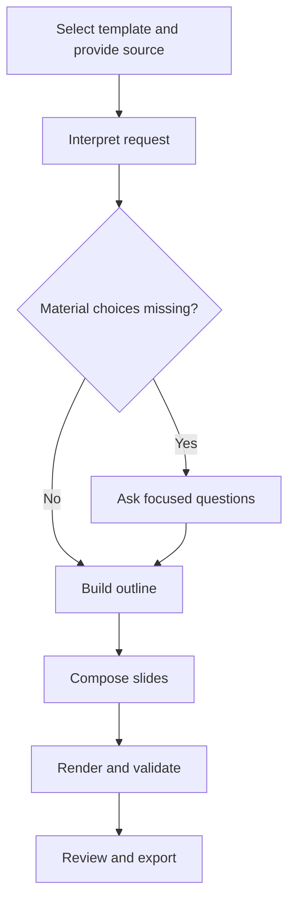

# Slide deck creation

[Product recipes](/workflow) · **Status:** Persisted recipe authoring and simulation; live runtime and renderer planned.

Turn source material into a presentation with an agreed narrative, slide count, wording policy and template. Its technical asset type is `presentations`.

[Open Product recipes →](http://127.0.0.1:5181/mvp/admin/recipes?demoRole=admin#admin-product-recipes) — select **Slide deck creation**. Save, validate, simulate and publish its definition. The initial policy asks for a brief, slide count, wording mode and audience when absent.

## Inputs and outcome

**Inputs:** selected template, source material, audience, purpose and published application-managed brand context. Capture slide count/range and whether to preserve or reshape the source text.

**Intended outcome:** a reviewable presentation with readable slides and traceable source content. The proposed contract includes an editable deck and previews; exact export formats and renderer remain to be selected.

## Proposed creation flow

This describes the target production flow. The saved v1 graph demonstrates clarification, AI instructions and branches using fixtures. This documentation diagram is not an executable definition; a published version's structured reference is authoritative.

## Clarification points

| Missing or conflicting choice | Ask when it changes the outcome |
| --- | --- |
| Slide count | How many slides, or what range, should the deck contain? |
| Source fidelity | Keep the wording verbatim, edit for clarity, or rethink the story? |
| Narrative | Who is the audience and what should they understand or decide? |
| Template | Which template family should be used? |
| Supporting detail | Should supported detail go into speaker notes? |

For “10 slides, keep the wording,” preserve those constraints without asking again. If the text cannot fit readably, explain the conflict and ask whether to add slides, permit editing, or move detail into notes where supported. Do not silently summarize.

Save clarification answers with their purpose and input revision so a user can leave and resume later. See [Product logic designer](/decisions/asset-workflows) for the shared interaction contract.

## Acceptance checks

Check the agreed slide count, readable content fit, source fidelity, required brand/template rules and actual exported files. A template preview alone does not demonstrate a working deck renderer.
