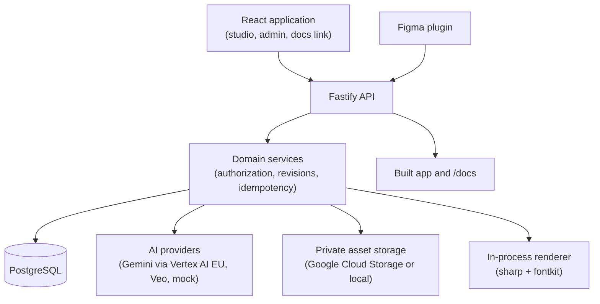

# Architecture

**Status:** Current · **Source reviewed:** 16 September 2026 (branch `v3`, commit `26c2598`)

This page describes the code as it is. The target product model is in the [product concept](../product/concept.md). The code still uses older names ("campaign", "Banner Studio"); see the [glossary](../product/glossary.md#old-names-and-where-they-still-appear).

## System overview

| Layer | Location | Notes |
| --- | --- | --- |
| Application | `src/` | React 19 and Vite. Entry `src/main.jsx` → `src/App.jsx` → `src/studio/StudioApp.jsx`. |
| UI foundation | `packages/brutalist-design-system` | Brutalist design system, a detachable workspace package (D36). Dev server and tests use its source; production builds use its built library. Rules in [FRONTEND.md](../../FRONTEND.md) and [design system integration](../specs/design-system-integration.md). |
| Campaign flow (current banner flow) | `src/studio/campaign/` | Six module hosts, runtime and coordinator. See [campaign modules](campaign-modules.md). |
| Admin | `src/studio/admin/`, `server/routes/admin.js`, `server/assetWorkflows/` | Read-only records and the frozen recipe node editor. See [admin](admin.md). |
| HTTP API | `server/app.js`, `server/bootstrap.js`, `server/start.js`, `server/routes/` | Fastify. |
| Business rules | `server/services/`, `shared/` | Services own authorization and integrity. `shared/` holds contracts (zod) used by browser and server. |
| Persistence | `server/db/migrations/` (53 migrations), `server/repositories/` | PostgreSQL. |
| Authentication | `server/auth/` | Firebase ID tokens in production; roles `marketer`, `designer`, `admin`. |
| AI providers | `server/providers/` | See [AI generation](ai-generation.md). |
| Brief sources | `server/briefSources/`, `server/briefTextExtractor.js` | Text, PDF, DOCX and PNG/JPEG/WebP within a 25 MB budget. See [briefing](briefing.md). |
| Storage | `server/storage/` | Google Cloud Storage in production; local demo store (`.studio-demo-assets/`); memory store in tests. |
| Rendering | `server/rendering/inProcessRenderer.js`, `shared/templateManifest.js` | Deterministic PNG rendering from template manifests. Fonts: Inter and Arimo at 400/600/700. |
| Brands and templates | `server/services/brandDesignSystemService.js`, `server/services/templateBrandService.js`, `shared/resolveTemplateBrand.js` | See [templates and brands](templates/banner-templates-and-brands.md). |
| Versions, review, delivery | `server/services/versionService.js`, `reviewService.js`, `deliveryService.js`, `shared/workflowRules.js` | Immutable versions with content hashes; ZIP package with manifest. |
| Figma | `figma-plugin/`, `server/services/figma*.js` | The plugin imports a scene package into Figma frames and submits returned artwork. |
| Documentation | `docs/` (content), `docs-site/` (VitePress shell) | Built into `dist/docs` and served at `/docs`. See [documentation](../documentation.md). |

## Application routes

| URL | View |
| --- | --- |
| `/` | Home: brief composer and recent projects |
| `/mvp/new` | Choose what to create (only banners is available) |
| `/mvp/campaign/:id?module=:module` | Campaign flow |
| `/mvp/templates` | Template catalog, banner template editor, MSD slide templates |
| `/mvp/system`, `/mvp/system/:id` | Brand library and brand details |
| `/mvp/settings` | Personal settings and AI connections |
| `/mvp/admin/...` | Admin area (admins only) |
| `/design-system` | Application design system reference |
| `/mvp/dev/modules/:module` | Development-only module playground with fixtures |
| `/docs/` | Team documentation |

## Runtime modes

| Mode | Command | What it uses |
| --- | --- | --- |
| Application with local API | `npm run dev` + `npm run dev:api` | Vite proxies `/api` to port 3010. The local API uses the `banner_studio_demo` database. |
| Offline prototype | `npm run dev:prototype` | Browser-only fixtures on port 5190; network calls to the API are blocked. |
| Production server | `npm start` | PostgreSQL, Firebase, Gemini/Vertex AI and Google Cloud Storage from environment variables. |

See [local development](local-development.md) for setup and safety notes.

## Current implementation versus target model

| Target concept | Current implementation |
| --- | --- |
| Projects with one fixed asset type | `campaigns` table and campaign runtime; banners only |
| Four stages: Brief, Copy, Visuals, Assets | Six modules: Brief, Copy, Visuals, Banners, Review, Distribute (Review shown inside Banners) |
| Recipe files drive the stages | Stage order and rules are hard-coded in `workflowCoordinator.js`, `shared/workflowRules.js` and services |
| Brand pinned per project; templates reference brands | Brand is copied into new global template versions; campaigns have no brand |
| Brand guidance in AI prompts | Prompts receive no brand information |
| Automatic checks decide acceptance; designer on escalation | Designer review is mandatory: `composed → in_review → ready → approved → delivered` |
| Deck projects delivering one PowerPoint file | Five MSD slide templates and AI content contracts exist; no deck generation or PPTX export |

## Build and hosting

- `npm run build` builds the application and the documentation into `dist/` and `dist/docs/`.
- `npm run verify:production` checks the build output and container.
- The `Dockerfile` uses Node 22 with FFmpeg, serves the built UI and docs through the Node server on port 8080, and defines a health check.
- `docker-compose.yml` provides PostgreSQL for development only.
- No production deployment or hosting provider has been chosen. See [hosting](../operations/hosting.md).

## Proposed extensions

The admin and data model proposal ([engineering proposal](proposals/admin-and-data-model.md)) describes projects, documents, runs, human tasks and durable workers. It predates the decisions of 16 September 2026 and must be reconciled with the asset creation flow model in the domain model specification.
