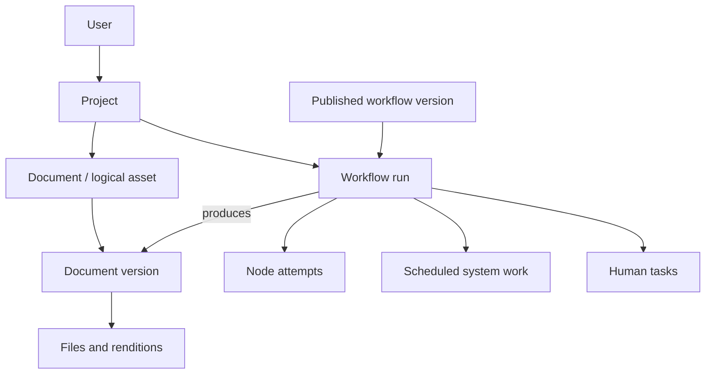

# Admin and data model

**Status:** Proposal · **Updated:** 10 September 2026 · **Review note, 16 September 2026:** predates the asset creation flow model and file-based recipes ([D6, D8](../../product/decisions.md)). Reconcile before use in the domain model specification.

## Admin scope

The admin area has its own shell and menu, using the application's shared design-system controls: **Overview, Users, Projects, Assets, Product recipes, Modules, System work and Activity**, plus Back to Studio. V1 serves internal operations administrators with access across the current application database. Customer workspace administration requires a separate membership/scoping design.

Overview counts and job durations come from stored records. Unmeasured provider latency and human-task timing are shown as unavailable. System work lists existing jobs; assignment, human tasks and recovery actions are later stages.

Admin lists read the same product database. Changes go through named services such as assign, answer, approve or retry; a generic table editor must not bypass domain rules.

## Entity relationships

This diagram is the target model. V1 uses existing campaign-backed projects and file sources, plus `asset_workflows` and `asset_workflow_versions`. General documents, runs and human tasks below are not yet created by recipe authoring.

A project can contain a deck, banner set and website. Each has a stable document identity, multiple revisions, and possibly several exports. A workflow run is one attempt to create or change that document.

## Existing records and proposed additions

| Area | Existing foundation | Proposed extension |
| --- | --- | --- |
| Identity | Users, invitations and roles | Explicit scope for the broader admin |
| Projects | Banner-oriented campaigns | Shared projects and typed documents before non-campaign workflows |
| Content and files | Compositions, immutable campaign versions, assets, deliveries | General document versions and typed rendition references |
| Design context | Versioned brand systems, templates, sources and assets | Pinned references on workflow runs |
| Processing | Campaign generation jobs and video operations | Generic runs, node attempts and durable scheduling |
| Human decisions | Review events and enforced review gates | Saved clarification/manual tasks and task views of review requests |
| History | Audit and review events | Append-only workflow events |

Backfill an existing campaign as a project containing one banner-set document. Preserve campaign IDs, source snapshots and review behavior through a compatibility adapter. Define one owner for shared title/archive metadata.

Published document snapshots and exported files are different records. A PDF and PPTX can belong to the same version. Files stay in object storage; PostgreSQL holds metadata and relationships.

## Human tasks and system work

| Human task | System work item |
| --- | --- |
| “Choose the slide count” | “Render the deck” |
| Recipient/assignee and eligibility | Worker lease and operation identity |
| Priority and due date | Earliest execution time |
| Question schema and recorded answer | Input/output references and delivery state |
| Completion may resume a run | Completion may schedule the next node |

One Work queue can present these as separate tabs. A personal notification points to a task; it is not the source of task state.

For review, a task binds an exact plan hash or artifact version. Completing it invokes the existing review service. Assigning a task grants no approval authority, and independent reviewer requirements continue to apply.

## Workflow tables and remaining additions

Use one subsystem with the `asset_workflow_*` naming:

- `asset_workflows` — implemented: editable draft, revision and active publication pointer.
- `asset_workflow_versions` — implemented: immutable published definitions.
- `asset_workflow_runs`: project/document references, inputs, pinned versions and current state.
- `asset_workflow_attempts`: intentional node attempts and external operation identity.
- `asset_workflow_jobs`: scheduling, worker ownership and recovery.
- `human_tasks`: durable questions, review coordination and manual work.
- `asset_workflow_events`: ordered transition history.

This consolidates the earlier proposal's blocking interaction records into human tasks. Nonblocking information becomes events. Do not implement parallel `workflow_*` and `asset_workflow_*` systems from different drafts of the plan.

Use relational fields for scope, relationships, status and scheduling. JSONB is appropriate for versioned graphs, structured answers and content. Credentials and large files stay outside those payloads.

## Durable execution

Persist the run and its first work item together. Workers use leases, and only the current owner may commit a result. Save each transition and its next scheduling intent atomically.

A question pauses the run. A validated, authorized answer and resume work item are committed together. Source edits invalidate stale questions and approvals.

A timeout after an AI submission can mean the provider is still working. Reconcile the saved operation identity rather than blindly issuing another paid request. Queue redelivery and an intentional new execution attempt are different events.

Object uploads are outside the database transaction: stage them, validate their metadata, attach references, and clean up unreferenced objects. Reject output adoption if the target document has changed.

## Authorization boundary

V1 uses the existing enabled-admin authorization guard for internal operations access. Customer workspace administration needs verified membership and scoped queries before broad access is exposed. Existing brand workspace identifiers alone do not establish complete tenant isolation.

The implemented asset view unions campaign files, stored brand sources and brand assets with namespaced IDs. Integrating a future document model into that view remains a later change.

Read the [detailed backend proposal](../../archive/superpowers/specs/2026-09-08-admin-backend-foundation-design.md) for invariants and the [delivery stages](../../archive/docs-site-2026-09/decisions/delivery.md) for ordering.
