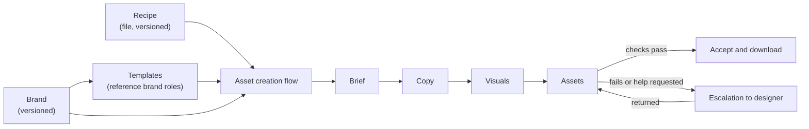

# Product requirements — Automation Studio proof of concept

**Status:** Target (draft for owner review) · **Version:** 0.1 · **Updated:** 17 September 2026 · **Owner:** Roman Kovbasyuk

This document defines what the proof of concept must do. It builds on the [product concept](concept.md), the [decision log](decisions.md) and the [roadmap](roadmap.md). Detailed behaviour is in the [specifications](../specs/index.md). Terms follow the [glossary](glossary.md).

Several answers were taken as recommended while the owner was unavailable; they are marked **(P#)** and listed in the decision log under provisional decisions.

## 1. Summary

Automation Studio turns a brief into finished, on-brand content. A company's brand is the foundation; templates built on the brand guarantee composition; recipes describe how AI and the user produce each asset type; automatic checks decide whether the result is acceptable; designers are involved only when it is not.

The proof of concept delivers two asset types — **banner sets** and **decks** — for one pilot brand, **MSD** (P8), and proves that a meaningful share of real briefs can be completed without a designer.

## 2. Problem

Producing on-brand marketing assets today requires a designer for every piece, even when the brand, the layouts and the message are already defined. Marketers wait, designers spend time on repetitive composition, and quality varies.

Generic AI tools produce content quickly but ignore brand rules, invent layouts and cannot guarantee legal or mandatory wording. Automation Studio combines AI generation with brand-governed templates and measurable quality checks, so routine assets need no designer and exceptional ones reach a designer with a clear reason.

## 3. Goals and non-goals

### Goals

| # | Goal | Measured by |
| --- | --- | --- |
| G1 | Requesters produce accepted banner sets and decks from a brief without a designer | Auto-acceptance rate per asset type |
| G2 | Output respects the brand | Hard-check pass rate; AI review brand-fit score; escalation reasons |
| G3 | Designers receive only work that needs them, with clear reasons | Share of escalations with a failed check or explicit reason; designer turnaround |
| G4 | The same recipe works for any brand | Recipe runs on a second brand without recipe changes |
| G5 | Requesters always understand the state of their work | No flow left in an unrecoverable state; usability observations |

### Non-goals for the proof of concept

- A recipe editing interface (recipes are files, D4, D8).
- Compliance workflows for regulated content (D5).
- Landing pages, websites and template creation as asset types.
- Editable PPTX or Google Slides output (P6).
- Publishing to advertising platforms or spending budget.
- Customer self-service onboarding and multi-workspace administration.
- New video capabilities.

## 4. Users

| Role | In code today | Needs |
| --- | --- | --- |
| **Requester** (marketer) | `marketer` | Start a flow from a brief and materials; review and adjust copy, visuals and outputs; accept and download; ask for design help |
| **Designer** | `designer` | Maintain brands and templates; receive escalations with reasons; elevate the work in Figma and return it |
| **Admin** (our team) | `admin` | Write and publish recipes; manage users, brands and templates; operate the pilot; read measures |

A person may hold only one role at a time, as today.

## 5. Scope overview

## 6. User journeys

### J1 — Requester creates a banner set

1. Chooses **Banner set** and supplies a brief: text and optional files (PDF, DOCX, images).
2. The flow opens immediately. Analysis runs in the Brief stage and shows progress.
3. Reviews the extracted summary, audience, goal, reach, visual keywords and any copy found in the materials. Answers only missing questions (for example sizes). Confirms the brief, which starts copy generation.
4. In Copy, reviews five options or the imported copy, edits and selects.
5. In Visuals, generates one image per selected copy, or uploads images, and selects them.
6. In Assets, sees every requested banner (copy × visual × template × size) with its check results.
7. Accepts passing banners, adjusts inputs for failing ones, or requests design help.
8. Downloads the package of accepted banners.

### J2 — Requester creates a deck

1. Chooses **Deck** and supplies a brief and materials.
2. Brief stage as in J1, plus slide count and wording fidelity when missing.
3. In Copy, reviews the proposed outline (one layout per slide), adjusts slides and layouts, then reviews and edits slide text.
4. In Visuals, generates or uploads artwork for slides with image slots.
5. In Assets, sees every slide rendered with check results and a document preview.
6. Accepts, adjusts or requests design help, then downloads PDF and slide images (P6).

### J3 — Escalation round trip

1. An asset fails a hard check after automatic repair, or the requester asks for design help with a reason.
2. An escalation is created with the reason, failed checks and the composed asset, and handed to Figma.
3. The designer elevates the asset in Figma and returns it.
4. The requester sees the returned version with its checks, then accepts it or asks for changes.

### J4 — Designer maintains a brand and its templates

1. Creates or updates a brand from materials (AI-assisted extraction with evidence), including voice, wording rules, image style and mandatory lines.
2. Publishes a brand version.
3. Publishes templates that reference brand roles and are available to that brand.

### J5 — Admin publishes a recipe

1. Edits a recipe file and its guidance in the repository.
2. Validation runs in tests; a diagram is generated for review (Mermaid, and FigJam through the Figma MCP).
3. On merge, new flows use the new recipe version; flows in progress keep theirs.

## 7. Functional requirements

Priority: **M** must for the proof of concept, **S** should, **C** could. Each requirement lists the specification that details it.

### 7.1 Asset creation flow

| ID | Requirement | Pri | Spec |
| --- | --- | --- | --- |
| FLOW-1 | A requester starts a flow by choosing an asset type (banner set or deck) and supplying a brief. | M | [UX](../specs/asset-creation-flow-ux.md) |
| FLOW-2 | Every flow has four stages — Brief, Copy, Visuals, Assets — defined by its recipe. | M | [Recipes](../specs/recipes.md) |
| FLOW-3 | A flow pins the brand version, recipe version and, once used, template versions. Later changes never alter a flow silently. | M | [Domain model](../specs/domain-model.md) |
| FLOW-4 | The flow opens immediately after creation; no work happens on the Home screen after submission. | M | [UX](../specs/asset-creation-flow-ux.md) |
| FLOW-5 | The flow header always shows the current state, whose turn it is and the next action. | M | [UX](../specs/asset-creation-flow-ux.md) |
| FLOW-6 | Stages are navigable when available; unavailable stages explain why. Navigation never starts generation. | M | [UX](../specs/asset-creation-flow-ux.md) |
| FLOW-7 | Changing an upstream input marks only dependent results as stale and keeps unrelated work. | M | [Domain model](../specs/domain-model.md) |
| FLOW-8 | A requester can explicitly upgrade a flow to a newer brand version; affected results become stale. | S | [Domain model](../specs/domain-model.md) |
| FLOW-9 | Flows are listed, renamed, duplicated and archived. | M | [UX](../specs/asset-creation-flow-ux.md) |

### 7.2 Brief

| ID | Requirement | Pri | Spec |
| --- | --- | --- | --- |
| BRIEF-1 | Accept text and files (text, PDF, DOCX, PNG, JPEG, WebP) up to 25 MB in total; unreadable files are reported and removable. | M | [Recipes](../specs/recipes.md) |
| BRIEF-2 | Analysis extracts summary, audience, goal, reach, visual keywords (at most 7 suggested) and copy found in the materials with source references. | M | [Recipes](../specs/recipes.md) |
| BRIEF-3 | Only questions whose answers are missing are asked; supplied answers are preserved. | M | [Recipes](../specs/recipes.md) |
| BRIEF-4 | The requester confirms the brief; confirmation is the explicit action that starts the recipe's next generation step. | M | [UX](../specs/asset-creation-flow-ux.md) |
| BRIEF-5 | The requester chooses to keep found copy verbatim or create new copy. | M | [Recipes](../specs/recipes.md) |

### 7.3 Copy

| ID | Requirement | Pri | Spec |
| --- | --- | --- | --- |
| COPY-1 | Banner sets: generate five copy options (headline, body, optional offer, CTA) within template limits, or import found copy. | M | [Recipes](../specs/recipes.md) |
| COPY-2 | Copy is written in the brand's voice and language, includes required wording and avoids forbidden terms. | M | [Brand model](../specs/brand-model.md) |
| COPY-3 | The requester edits, deletes, selects and generates more options; generating more appends and preserves edits. | M | [UX](../specs/asset-creation-flow-ux.md) |
| COPY-4 | Decks: propose an outline choosing one available layout per slide, then fill each slide's text within its layout contract. | M | [Deck generation](../specs/deck-generation.md) |
| COPY-5 | Decks: the requester reorders, adds and removes slides, changes layouts and edits slide text. | M | [Deck generation](../specs/deck-generation.md) |
| COPY-6 | Copy origin (supplied, generated, edited) is recorded. | M | [Domain model](../specs/domain-model.md) |

### 7.4 Visuals

| ID | Requirement | Pri | Spec |
| --- | --- | --- | --- |
| VIS-1 | Banner sets: generate one image per selected copy using the brand's image style and the brief's visual keywords. | M | [Recipes](../specs/recipes.md) |
| VIS-2 | Decks: generate or upload artwork for slides with image slots (P7). | M | [Deck generation](../specs/deck-generation.md) |
| VIS-3 | Upload images instead of generating; uploads are validated (type, size, minimum dimensions). | M | [Recipes](../specs/recipes.md) |
| VIS-4 | Regenerate a single image without affecting others; successful results are kept when others fail. | M | [UX](../specs/asset-creation-flow-ux.md) |
| VIS-5 | Generated images contain no text or logos and leave space for layout. | M | [Recipes](../specs/recipes.md) |

### 7.5 Assets

| ID | Requirement | Pri | Spec |
| --- | --- | --- | --- |
| ASSET-1 | Banner sets: compose every requested combination of selected copy/visual pairs, available templates and chosen sizes, and show the total before composing. | M | [Template model](../specs/template-model.md) |
| ASSET-2 | Decks: compose every slide in order and a document preview. | M | [Deck generation](../specs/deck-generation.md) |
| ASSET-3 | Preview and export use the same renderer, fonts and resolved template. | M | [Template model](../specs/template-model.md) |
| ASSET-4 | Every output runs hard checks; results are visible per output with plain explanations. | M | [Quality and escalation](../specs/quality-and-escalation.md) |
| ASSET-5 | Failing text fit is repaired automatically before escalation (bounded attempts). | M | [Quality and escalation](../specs/quality-and-escalation.md) |
| ASSET-6 | AI review scores each output in shadow mode and shows the score and concerns. | S | [Quality and escalation](../specs/quality-and-escalation.md) |
| ASSET-7 | The requester accepts outputs that pass hard checks; outputs failing a hard check cannot be accepted. | M | [Quality and escalation](../specs/quality-and-escalation.md) |
| ASSET-8 | The requester downloads a package of accepted outputs: banners as PNG; decks as PDF plus PNG per slide (P6); always with a manifest. | M | [Quality and escalation](../specs/quality-and-escalation.md) |

### 7.6 Escalation

| ID | Requirement | Pri | Spec |
| --- | --- | --- | --- |
| ESC-1 | Offer design help automatically when a hard check still fails after repair; allow requesting it for any output at any time with a reason. | M | [Quality and escalation](../specs/quality-and-escalation.md) |
| ESC-2 | An escalation records reason, failed checks, outputs, requester, designer and timestamps. | M | [Quality and escalation](../specs/quality-and-escalation.md) |
| ESC-3 | Escalated outputs are handed to Figma through the existing plugin; the designer returns elevated artwork. | M | [Quality and escalation](../specs/quality-and-escalation.md) |
| ESC-4 | Returned artwork passes file checks and is accepted by the requester, who can ask for further changes. | M | [Quality and escalation](../specs/quality-and-escalation.md) |
| ESC-5 | Requesters see escalation state and expected turnaround; designers see a queue of open escalations. | M | [UX](../specs/asset-creation-flow-ux.md) |

### 7.7 Brands and templates

| ID | Requirement | Pri | Spec |
| --- | --- | --- | --- |
| BRAND-1 | Brands include voice, wording rules (mandatory lines, forbidden terms), image style, languages and logo usage, in addition to colors, typography and logos. | M | [Brand model](../specs/brand-model.md) |
| BRAND-2 | Brand guidance is supplied to copy generation, image generation and AI review. | M | [Brand model](../specs/brand-model.md) |
| BRAND-3 | A brand is automation-ready only when its required fields are confirmed and its fonts are usable by the renderer. | M | [Brand model](../specs/brand-model.md) |
| BRAND-4 | Brands support licensed font files beyond the bundled families. | S | [Brand model](../specs/brand-model.md) |
| TPL-1 | Templates reference brand roles and are resolved with the flow's brand version at composition; no per-brand template copies. | M | [Template model](../specs/template-model.md) |
| TPL-2 | Templates declare asset type, formats or canvas, slots with content limits and an AI content contract. | M | [Template model](../specs/template-model.md) |
| TPL-3 | Templates declare which brands may use them. | M | [Template model](../specs/template-model.md) |
| TPL-4 | MSD slide layouts become published templates of asset type slide. | M | [Deck generation](../specs/deck-generation.md) |

### 7.8 Recipes

| ID | Requirement | Pri | Spec |
| --- | --- | --- | --- |
| RCP-1 | Recipes are versioned files validated against a schema and the capability catalog in tests and at startup. | M | [Recipes](../specs/recipes.md) |
| RCP-2 | The `banner-set` and `deck` recipes drive their flows. | M | [Recipes](../specs/recipes.md) |
| RCP-3 | Diagrams can be generated from every recipe. | S | [Recipes](../specs/recipes.md) |
| RCP-4 | The recipe node editor is frozen and hidden from non-admins. | S | [Campaign migration](../specs/campaign-migration.md) |

## 8. Non-functional requirements

| ID | Requirement |
| --- | --- |
| NFR-1 **Reliability** | No generation outcome can leave a flow unusable. Uncertain outcomes are reconciled or resolvable by the user. Certain failures are recorded as failed. |
| NFR-2 **No surprise cost** | Generation starts only from explicit actions. Per-operation cost caps remain. Automatic repairs have bounded attempts. |
| NFR-3 **Integrity** | Accepted and delivered outputs are immutable and record exact brand, template, recipe and input versions with checksums. |
| NFR-4 **Security and privacy** | AI processing stays in approved EU regions. Credentials are never exposed to browsers or documents. Brief materials are treated as untrusted data. |
| NFR-5 **Accessibility** | WCAG 2.2 AA for the application ([FRONTEND.md](../../FRONTEND.md)). |
| NFR-6 **Design system** | Application UI uses the Brutalist package and follows [design system integration](../specs/design-system-integration.md). |
| NFR-7 **Performance** | Targets set before the pilot: time to analysis result, per-image generation, composition of a 20-banner set, deck of 10 slides. |
| NFR-8 **Auditability** | Acceptances, escalations, returns and recipe/brand version use are recorded as audit events. |
| NFR-9 **Observability** | Pilot measures (section 9) are derivable from stored records without manual tracking. |

## 9. Measures

Targets are agreed before the pilot starts.

| Measure | Definition |
| --- | --- |
| Auto-acceptance rate | Accepted outputs without escalation ÷ all accepted outputs, per asset type |
| Flow completion rate | Flows reaching download ÷ flows with a confirmed brief |
| Escalation rate and reasons | Escalations per flow; distribution by failed check or stated reason |
| Designer turnaround | Escalation created → returned |
| Time to first package | Brief submitted → first download |
| Cost per accepted output | Provider cost ÷ accepted outputs |
| AI review agreement | Share of outputs where the shadow score's pass/fail matches accept/escalate |

## 10. Release plan

| Milestone | Contents | Requirements |
| --- | --- | --- |
| M0 Stabilise | Job lock fix, flow creation, dead code, naming | NFR-1, FLOW-4 |
| M1 Brand as input | Brand guidance, pinned brand versions, role-referenced templates, prompts with brand context | FLOW-3, BRAND-1–3, TPL-1–3, COPY-2 |
| M2 Banner recipe and Assets | Recipe loader, `banner-set`, four-stage UI, checks, repair, acceptance, escalation | FLOW-1–9, BRIEF-*, COPY-1/3/6, VIS-1/3–5, ASSET-1/3–8, ESC-*, RCP-1–2 |
| M3 Deck recipe | Slide templates, outline and fill, artwork, PDF | COPY-4–5, VIS-2, ASSET-2, TPL-4 |
| M4 Pilot | Real briefs, live AI, measures | Section 9 |

The design-system track (DS1–DS5 in the [roadmap](roadmap.md)) runs alongside M0–M2.

## 11. Risks

| Risk | Impact | Mitigation |
| --- | --- | --- |
| Three banner layouts and five slide layouts limit variety | Outputs look repetitive; lower acceptance | Measure acceptance per template; add templates before widening the pilot |
| AI copy exceeds template limits often | Many repairs and escalations | Template limits in prompts; bounded shorten repair; track repair rate |
| Brand guidance is incomplete | Off-brand copy or imagery | Automation-ready gate; AI-assisted extraction with evidence |
| Image generation quality or safety blocks | Visuals stage stalls | Upload alternative; single-image regeneration; blocked results explained |
| Designer availability | Escalations wait | Named pilot designer and turnaround target (open) |
| Figma plugin dependency | Escalation cannot start | Keep file-based fallback (download composed asset, upload returned PNG) as S priority |
| Migration from campaigns breaks existing work | Lost or inconsistent flows | Additive migration; legacy reviews complete under old rules ([campaign migration](../specs/campaign-migration.md)) |
| Scope growth before the pilot | Delay | Non-goals in section 3; decision log for changes |

## 12. Assumptions and dependencies

- MSD is the pilot brand (P8); its brand version and templates are prepared before M4.
- Gemini text, image and review models are available through Vertex AI in the EU.
- The Figma plugin and handoff services keep working for escalations.
- The Brutalist change requests R1–R3 are released before the M2 interface.
- The asset creation flow is the top-level record (P9).

## 13. Open questions

| Question | Owner | Needed by |
| --- | --- | --- |
| Who is the pilot designer, and what escalation turnaround is committed? | Owner | M2 |
| Measure targets for the pilot | Owner | M4 start |
| Should outputs failing only the AI review be acceptable once review leaves shadow mode? | Owner | After M4 |
| Is a file-based escalation fallback (without the Figma plugin) needed for the pilot? | Owner | M2 |
