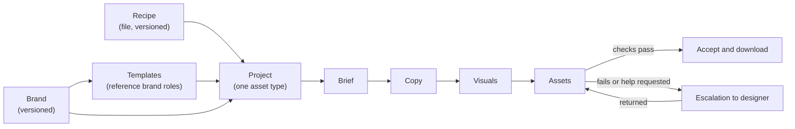

# Product requirements — Automation Studio proof of concept

**Status:** Target (draft for owner review) · **Version:** 0.2 · **Updated:** 17 September 2026 · **Owner:** Roman Kovbasyuk

This document defines what the proof of concept must do. It builds on the [product concept](concept.md), the [decision log](decisions.md) and the [roadmap](roadmap.md). Detailed behaviour is in the [specifications](../specs/index.md). Terms follow the [glossary](glossary.md).

**Changes in 0.2:** decks are delivered as PPTX (D17) and escalated by editing the PPTX (D18); deck image slots use template placeholders (D19); Folkeuniversitetet is the pilot brand with its licensed Matter font (D20, D21); the top-level record is a Project with one fixed asset type (D22, D23); Roman Kovbasyuk is the pilot designer with a one-business-day turnaround (D28); measure targets are set after the first pilot week (D29).

## 1. Summary

Automation Studio turns a brief into finished, on-brand content. A company's brand is the foundation; templates built on the brand guarantee composition; recipes describe how AI and the user produce each asset type; automatic checks decide whether the result is acceptable; designers are involved only when it is not.

The proof of concept delivers two asset types — **banner sets** (PNG) and **decks** (editable PowerPoint) — for the pilot brand **Folkeuniversitetet**, and proves that a meaningful share of real briefs can be completed without a designer.

## 2. Problem

Producing on-brand marketing assets today requires a designer for every piece, even when the brand, the layouts and the message are already defined. Marketers wait, designers spend time on repetitive composition, and quality varies.

Generic AI tools produce content quickly but ignore brand rules, invent layouts and cannot guarantee legal or mandatory wording. Automation Studio combines AI generation with brand-governed templates and measurable quality checks, so routine assets need no designer and exceptional ones reach a designer with a clear reason.

## 3. Goals and non-goals

### Goals

| # | Goal | Measured by |
| --- | --- | --- |
| G1 | Requesters produce accepted banner sets and decks from a brief without a designer | Auto-acceptance rate per asset type |
| G2 | Output respects the brand | Hard-check pass rate; AI review brand-fit score; escalation reasons |
| G3 | Designers receive only work that needs them, with clear reasons | Share of escalations with a failed check or explicit reason; designer turnaround |
| G4 | The same recipe works for any brand | Recipe runs on a second brand without recipe changes |
| G5 | Requesters always understand the state of their work | No project left in an unrecoverable state; usability observations |

### Non-goals for the proof of concept

- A recipe editing interface (recipes are files, D4, D8).
- Compliance workflows for regulated content (D5).
- Landing pages, websites, newsletters and template creation as asset types.
- Deck output as PDF or Google Slides (D17).
- Image generation or upload for decks (D19).
- Reusing a brief in another project (D22).
- Publishing to advertising platforms or spending budget.
- Customer self-service onboarding and multi-workspace administration.
- New video capabilities.

## 4. Users

| Role | In code today | Needs |
| --- | --- | --- |
| **Requester** (marketer) | `marketer` | Start a project from a brief and materials; review and adjust copy, visuals and assets; accept and download; ask for design help |
| **Designer** | `designer` | Maintain brands and templates; receive escalations with reasons; elevate the work and return it. In the pilot: Roman Kovbasyuk (D28) |
| **Admin** (our team) | `admin` | Write and publish recipes; manage users, brands and templates; operate the pilot; read measures |

A person holds one role at a time, as today.

## 5. Scope overview

## 6. User journeys

### J1 — Requester creates a banner set

1. Starts a **Banner set** project and supplies a brief: text and optional files (PDF, DOCX, images).
2. The project opens immediately. Analysis runs in the Brief stage and shows progress.
3. Reviews the extracted summary, audience, goal, reach, visual keywords and any copy found in the materials. Answers only missing questions (for example sizes). Confirms the brief, which starts copy generation.
4. In Copy, reviews five options or the imported copy, edits and selects.
5. In Visuals, generates one image per selected copy, or uploads images, and selects them.
6. In Assets, sees every requested banner (copy × image × template × size) with its check results.
7. Accepts passing banners, adjusts inputs for failing ones, or requests design help.
8. Downloads the package of accepted banners.

### J2 — Requester creates a deck

1. Starts a **Deck** project and supplies a brief and materials.
2. Brief stage as in J1, plus slide count and wording fidelity when missing.
3. In Copy, reviews the proposed outline (one layout per slide), adjusts slides and layouts, then reviews and edits slide text.
4. In Visuals, sees that image slots use the placeholders defined in the slide templates; nothing to generate (D19).
5. In Assets, sees every slide rendered with check results.
6. Accepts the deck, or requests design help, then downloads the PowerPoint file (D17) and replaces placeholders with images in PowerPoint if needed.

### J3 — Escalation round trip

1. An asset fails a hard check after automatic repair, or the requester asks for design help with a reason.
2. An escalation is created with the reason and failed checks.
3. **Banners:** handed to Figma through the plugin; the designer elevates them in Figma and returns them from the plugin.
4. **Decks:** the designer downloads the generated PowerPoint file, improves it in PowerPoint or Keynote and uploads it back (D18).
5. The requester sees the returned version, then accepts it or asks for changes.

### J4 — Designer maintains a brand and its templates

1. Creates or updates a brand from materials (AI-assisted extraction with evidence), including voice, wording rules, image style, mandatory lines and licensed font files (Matter for Folkeuniversitetet, D21).
2. Publishes a brand version.
3. Publishes templates that reference brand roles and are available to that brand, including slide templates whose image slots define their placeholders.

### J5 — Admin publishes a recipe

1. Edits a recipe file and its guidance in the repository.
2. Validation runs in tests; a diagram is generated for review (Mermaid, and FigJam through the Figma MCP).
3. On merge, new projects use the new recipe version; projects in progress keep theirs.

## 7. Functional requirements

Priority: **M** must for the proof of concept, **S** should, **C** could. Each requirement lists the specification that details it.

### 7.1 Projects and the asset creation flow

| ID | Requirement | Pri | Spec |
| --- | --- | --- | --- |
| FLOW-1 | A requester starts a project by choosing an asset type (banner set or deck) and supplying a brief. | M | [UX](../specs/asset-creation-flow-ux.md) |
| FLOW-2 | Every project runs the four-stage asset creation flow — Brief, Copy, Visuals, Assets — defined by its recipe. | M | [Recipes](../specs/recipes.md) |
| FLOW-3 | A project pins the brand version, recipe version and, once used, template versions. Later changes never alter a project silently. | M | [Domain model](../specs/domain-model.md) |
| FLOW-4 | The project opens immediately after creation; no work happens on the Home screen after submission. | M | [UX](../specs/asset-creation-flow-ux.md) |
| FLOW-5 | The project header always shows the current state, whose turn it is and the next action. | M | [UX](../specs/asset-creation-flow-ux.md) |
| FLOW-6 | Stages are navigable when available; unavailable stages explain why. Navigation never starts generation. | M | [UX](../specs/asset-creation-flow-ux.md) |
| FLOW-7 | Changing an upstream input marks only dependent results as stale and keeps unrelated work. | M | [Domain model](../specs/domain-model.md) |
| FLOW-8 | A requester can explicitly upgrade a project to a newer brand version; affected results become stale. | S | [Domain model](../specs/domain-model.md) |
| FLOW-9 | Projects are listed, renamed, duplicated and archived. | M | [UX](../specs/asset-creation-flow-ux.md) |
| FLOW-10 | The asset type is fixed at creation. A banner project delivers any number of banners; a deck project delivers exactly one deck (D22). | M | [Domain model](../specs/domain-model.md) |

### 7.2 Brief

| ID | Requirement | Pri | Spec |
| --- | --- | --- | --- |
| BRIEF-1 | Accept text and files (text, PDF, DOCX, PNG, JPEG, WebP) up to 25 MB in total; unreadable files are reported and removable. | M | [Recipes](../specs/recipes.md) |
| BRIEF-2 | Analysis extracts summary, audience, goal, reach, visual keywords (at most 7 suggested) and copy found in the materials with source references. | M | [Recipes](../specs/recipes.md) |
| BRIEF-3 | The analysis prefills the settings it has a basis for and marks them as suggested; the requester reviews every setting and answers those left empty. | M | [Brief review](../specs/brief-review.md) |
| BRIEF-4 | The requester confirms the brief; confirmation is the explicit action that starts the recipe's next generation step. | M | [UX](../specs/asset-creation-flow-ux.md) |
| BRIEF-5 | Found copy is always kept; the requester chooses whether to also write new copy options. | M | [Brief review](../specs/brief-review.md) |

### 7.3 Copy

| ID | Requirement | Pri | Spec |
| --- | --- | --- | --- |
| COPY-1 | Banner sets: generate five copy options (headline, body, optional offer, CTA) within template limits, or import found copy. | M | [Recipes](../specs/recipes.md) |
| COPY-2 | Copy is written in the brand's voice and language, includes required wording and avoids forbidden terms. | M | [Brand model](../specs/brand-model.md) |
| COPY-3 | The requester edits, deletes, selects and generates more options; generating more appends and preserves edits. | M | [UX](../specs/asset-creation-flow-ux.md) |
| COPY-4 | Decks: propose an outline choosing one available layout per slide, then fill each slide's text within its layout contract. | M | [Deck generation](../specs/deck-generation.md) |
| COPY-5 | Decks: the requester reorders, adds and removes slides, changes layouts and edits slide text. | M | [Deck generation](../specs/deck-generation.md) |
| COPY-6 | Copy origin (supplied, generated, edited) is recorded. | M | [Domain model](../specs/domain-model.md) |

### 7.4 Visuals

| ID | Requirement | Pri | Spec |
| --- | --- | --- | --- |
| VIS-1 | Banner sets: generate one image per selected copy using the brand's image style and the brief's visual keywords. | M | [Recipes](../specs/recipes.md) |
| VIS-2 | Decks: image slots use the placeholder defined in the slide template; no image generation or upload (D19). | M | [Deck generation](../specs/deck-generation.md) |
| VIS-3 | Banner sets: upload images instead of generating; uploads are validated (type, size, minimum dimensions). | M | [Recipes](../specs/recipes.md) |
| VIS-4 | Banner sets: regenerate a single image without affecting others; successful results are kept when others fail. | M | [UX](../specs/asset-creation-flow-ux.md) |
| VIS-5 | Generated images contain no text or logos and leave space for layout. | M | [Recipes](../specs/recipes.md) |

### 7.5 Assets

| ID | Requirement | Pri | Spec |
| --- | --- | --- | --- |
| ASSET-1 | Banner sets: compose every requested combination of selected copy/image pairs, available templates and chosen sizes, and show the total before composing. | M | [Template model](../specs/template-model.md) |
| ASSET-2 | Decks: compose all slides of the one deck, show slide previews and check results per slide. | M | [Deck generation](../specs/deck-generation.md) |
| ASSET-3 | Previews and exported files use the same resolved template, content and fonts. | M | [Template model](../specs/template-model.md) |
| ASSET-4 | Every asset runs hard checks; results are visible with plain explanations (per banner; per slide for decks). | M | [Quality and escalation](../specs/quality-and-escalation.md) |
| ASSET-5 | Failing text fit is repaired automatically before escalation (bounded attempts). | M | [Quality and escalation](../specs/quality-and-escalation.md) |
| ASSET-6 | AI review scores each banner and each slide in shadow mode and shows the score and concerns. | S | [Quality and escalation](../specs/quality-and-escalation.md) |
| ASSET-7 | The requester accepts assets that pass hard checks: each banner individually; a deck as a whole when every slide passes. | M | [Quality and escalation](../specs/quality-and-escalation.md) |
| ASSET-8 | The requester downloads a package of accepted assets: banners as PNG; a deck as one PPTX file (D17); always with a manifest. | M | [Quality and escalation](../specs/quality-and-escalation.md) |

### 7.6 Escalation

| ID | Requirement | Pri | Spec |
| --- | --- | --- | --- |
| ESC-1 | Offer design help automatically when a hard check still fails after repair; allow requesting it for any asset at any time with a reason. | M | [Quality and escalation](../specs/quality-and-escalation.md) |
| ESC-2 | An escalation records reason, failed checks, assets, requester, designer and timestamps. | M | [Quality and escalation](../specs/quality-and-escalation.md) |
| ESC-3 | Banners are handed to Figma through the existing plugin and returned from it. Decks are downloaded as PPTX, edited by the designer and uploaded back (D18). | M | [Quality and escalation](../specs/quality-and-escalation.md) |
| ESC-4 | Returned banners and decks pass file checks and are accepted by the requester, who can ask for further changes. | M | [Quality and escalation](../specs/quality-and-escalation.md) |
| ESC-5 | Requesters see escalation state and the expected return time (one business day, D28); designers see a queue of open escalations. | M | [UX](../specs/asset-creation-flow-ux.md) |

### 7.7 Brands and templates

| ID | Requirement | Pri | Spec |
| --- | --- | --- | --- |
| BRAND-1 | Brands include voice, wording rules (mandatory lines, forbidden terms), image style, languages and logo usage, in addition to colors, typography and logos. | M | [Brand model](../specs/brand-model.md) |
| BRAND-2 | Brand guidance is supplied to copy generation, image generation and AI review. | M | [Brand model](../specs/brand-model.md) |
| BRAND-3 | A brand is automation-ready only when its required fields are confirmed and its fonts are usable by the renderer. | M | [Brand model](../specs/brand-model.md) |
| BRAND-4 | Brands support licensed font files beyond the bundled families (Matter for Folkeuniversitetet, D21). | M | [Brand model](../specs/brand-model.md) |
| TPL-1 | Templates reference brand roles and are resolved with the project's brand version at composition; no per-brand template copies. | M | [Template model](../specs/template-model.md) |
| TPL-2 | Templates declare output kind, formats or canvas, slots with content limits and an AI content contract. | M | [Template model](../specs/template-model.md) |
| TPL-3 | Templates declare which brands may use them. | M | [Template model](../specs/template-model.md) |
| TPL-4 | A Folkeuniversitetet slide template set is created and published; the existing MSD slide layouts become templates restricted to MSD. | M | [Deck generation](../specs/deck-generation.md) |
| TPL-5 | Image slots declare the placeholder shown until an image is inserted (D19). | M | [Template model](../specs/template-model.md) |

### 7.8 Recipes

| ID | Requirement | Pri | Spec |
| --- | --- | --- | --- |
| RCP-1 | Recipes are versioned files validated against a schema and the capability catalog in tests and at startup. | M | [Recipes](../specs/recipes.md) |
| RCP-2 | The `banner-set` and `deck` recipes drive their projects. | M | [Recipes](../specs/recipes.md) |
| RCP-3 | Diagrams can be generated from every recipe. | S | [Recipes](../specs/recipes.md) |
| RCP-4 | The recipe node editor is frozen and hidden from non-admins. | S | [Campaign migration](../specs/campaign-migration.md) |

## 8. Non-functional requirements

| ID | Requirement |
| --- | --- |
| NFR-1 **Reliability** | No generation outcome can leave a project unusable. Uncertain outcomes are reconciled or resolvable by the user. Certain failures are recorded as failed. |
| NFR-2 **No surprise cost** | Generation starts only from explicit actions. Per-operation cost caps remain. Automatic repairs have bounded attempts. |
| NFR-3 **Integrity** | Accepted and delivered assets are immutable and record exact brand, template, recipe and input versions with checksums. |
| NFR-4 **Security and privacy** | AI processing stays in approved EU regions. Credentials are never exposed to browsers or documents. Brief materials are treated as untrusted data. Licensed font files are stored privately and used only for rendering and exports. |
| NFR-5 **Accessibility** | WCAG 2.2 AA for the application ([FRONTEND.md](../../FRONTEND.md)). |
| NFR-6 **Design system** | Application UI uses the Brutalist package and follows [design system integration](../specs/design-system-integration.md). |
| NFR-7 **Performance** | Targets set after the first pilot week (D29): time to analysis result, per-image generation, composition of a 20-banner set, a 10-slide deck. |
| NFR-8 **Auditability** | Acceptances, escalations, returns and recipe/brand version use are recorded as audit events. |
| NFR-9 **Observability** | Pilot measures (section 9) are derivable from stored records without manual tracking. |

## 9. Measures

Targets are set from the baseline of the first pilot week (D29).

| Measure | Definition |
| --- | --- |
| Auto-acceptance rate | Accepted assets without escalation ÷ all accepted assets, per asset type |
| Project completion rate | Projects reaching download ÷ projects with a confirmed brief |
| Escalation rate and reasons | Escalations per project; distribution by failed check or stated reason |
| Designer turnaround | Escalation created → returned (target: one business day, D28) |
| Time to first package | Brief submitted → first download |
| Cost per accepted asset | Provider cost ÷ accepted assets |
| AI review agreement | Share of assets where the shadow score's pass/fail matches accept/escalate |

## 10. Release plan

| Milestone | Contents | Requirements |
| --- | --- | --- |
| M0 Stabilise | Job lock fix, project creation, dead code, naming | NFR-1, FLOW-4 |
| M1 Brand as input | Brand guidance, licensed brand fonts (Matter), pinned brand versions, role-referenced templates, prompts with brand context | FLOW-3, BRAND-1–4, TPL-1–3, COPY-2 |
| M2 Banner recipe and Assets | Recipe loader, `banner-set`, four-stage UI, checks, repair, acceptance, Figma escalation | FLOW-1–10, BRIEF-*, COPY-1/3/6, VIS-1/3–5, ASSET-1/3–8, ESC-*, RCP-1–2 |
| M3 Deck recipe | Folkeuniversitetet slide templates with placeholders, outline and fill, PPTX export, PPTX escalation | COPY-4–5, VIS-2, ASSET-2, TPL-4–5, ESC-3 (decks) |
| M4 Pilot | Real Folkeuniversitetet briefs, live AI, baseline week, measures | Section 9 |

The design-system track (DS0–DS3 in the [roadmap](roadmap.md)) runs alongside M0–M2.

## 11. Risks

| Risk | Impact | Mitigation |
| --- | --- | --- |
| Few layouts (3 banner templates; one new slide set) | Outputs look repetitive; lower acceptance | Measure acceptance per template; add templates before widening the pilot |
| AI copy exceeds template limits often | Many repairs and escalations | Template limits in prompts; bounded shorten repair; track repair rate |
| Brand guidance is incomplete | Off-brand copy or imagery | Automation-ready gate; AI-assisted extraction with evidence |
| Matter is not installed where a PPTX is opened | Text reflows or overflows in PowerPoint | Package notes list required fonts; fit is measured with Matter; font embedding evaluated during M3 |
| One person is both template author and escalation designer (D28) | Template creation and escalations compete for time | Create the slide template set before M3 build; track escalation turnaround weekly |
| Image generation quality or safety blocks (banners) | Visuals stage stalls | Upload alternative; single-image regeneration; blocked results explained |
| Figma plugin dependency (banners) | Banner escalation cannot start | File-based fallback (download composed banner, upload returned PNG) as S priority |
| Migration from campaigns breaks existing work | Lost or inconsistent projects | Additive migration; legacy reviews complete under old rules ([campaign migration](../specs/campaign-migration.md)) |
| Scope growth before the pilot | Delay | Non-goals in section 3; decision log for changes |

## 12. Assumptions and dependencies

- Folkeuniversitetet is automation-ready before M4, with Matter font files uploaded (D20, D21).
- A Folkeuniversitetet slide template set exists before M3 build (TPL-4).
- Gemini text, image and review models are available through Vertex AI in the EU.
- The Figma plugin and handoff services keep working for banner escalations.
- The Brutalist gap fixes R1–R3 are made in the workspace package before the M2 interface (D36).

## 13. Open questions

| Question | Owner | Needed by |
| --- | --- | --- |
| Should assets failing only the AI review be acceptable once review leaves shadow mode? | Owner | After M4 |
| Is a file-based banner escalation fallback (without the Figma plugin) needed for the pilot? | Owner | M2 |
| Should generated PPTX files embed fonts, or is installing Matter a documented requirement? | Owner | M3 |
