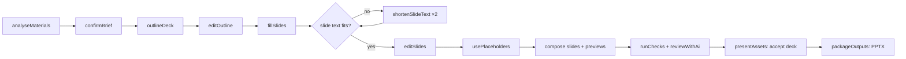

# Deck generation

**Status:** Target (draft for owner review) · **Updated:** 17 September 2026 · **Requirements:** COPY-4, COPY-5, VIS-2, ASSET-2, ASSET-7, ASSET-8, ESC-3, TPL-4, TPL-5 · **Decisions:** D17–D22

How the `deck` recipe turns a brief into one editable PowerPoint deck for a brand, and how designers improve it when needed.

## Scope for the proof of concept

- **Brand:** Folkeuniversitetet (D20), with Matter for headings and Inter for body text (D21).
- **Deliverable:** exactly one deck per project (D22), delivered as an editable **PPTX** file (D17). No PDF.
- **Size:** 3 to 15 slides, 16:9.
- **Images:** image slots show the **placeholder defined in the slide template** (D19). No image generation or upload for decks.
- **Escalation:** the designer edits the PPTX itself (D18).
- Not included: speaker notes, transitions, charts, embedded video.

## Starting point in the code

`shared/msdPresentationTemplates.js` implements five MSD layouts and reusable contract logic:

| Function | Purpose |
| --- | --- |
| `createMsdPresentationTemplates(sourceManifest)` | Five layouts on a 1280 × 720 `widescreen` canvas with 32 px safe areas |
| `presentationPlanContract({ templateGroupId, brief })` | AI schema to choose a layout per content moment |
| `presentationAiContract(template)` | AI schema for one layout's text fields with character limits |
| `validatePresentationValues(template, values, measure)` | Rejects unknown fields, missing text, excess characters or lines, changed page or stage numbers; checks wrapped lines when given a `measure` function |

MSD layouts (characters / lines), used as the model for the Folkeuniversitetet set:

| Layout | Purpose | Text fields | Image slot |
| --- | --- | --- | --- |
| Opening | Opening statement | `headline` 48/3, `body` 95/2, `footer` 65/1, `page` 3/1 | yes |
| Editorial | Story and context | `headline` 48/3, `body` 155/4, `caption` 80/2, `footer` 65/1, `page` 3/1 | yes |
| Evidence | Key numbers | `headline` 40/2, `insight` 66/3, `value1–3` 7/1, `label1–3` 65/2, `source` 110/1, `footer` 65/1, `page` 3/1 | no |
| Roadmap | Four stages | `headline` 36/1, `stage1–4` 2/1, `title1–4` 25/2, `body1–4` 76/3, `footer` 65/1, `page` 3/1 | no |
| Closing | Closing and next step | `headline` 45/3, `nextStep` 52/1, `contact` 75/1 | yes |

Nothing calls these from a service today; there is no deck generation or PPTX export.

## Folkeuniversitetet slide template set

Created by the pilot designer before M3 build (TPL-4), as published templates of output kind `slide` in one template set with `brandScope: [Folkeuniversitetet]` ([template model](template-model.md)).

| Requirement | Detail |
| --- | --- |
| Layout purposes | At least opening, story, key numbers, process (steps) and closing; each with a `purpose` text for outline selection |
| Canvas | 1280 × 720 design units (13.333 × 7.5 inches), safe areas declared |
| Text slots | Role, limits (characters, lines), font role (`heading` → Matter, `body` → Inter), minimum font size, colour role |
| Fixed slots | Page number and step numbers, filled by composition |
| Image slots | Placement plus a **placeholder definition**: shape, fill colour role or value, label text (for example *Replace image*), label font role |
| Logo | Logo slot with role and minimum size |
| Required lines | `requiredLine` slot where the brand requires lines on decks |

The MSD layouts become templates restricted to MSD. They remain available for a second-brand test (goal G4) but are not part of the Folkeuniversitetet pilot.

## Pipeline

### 1. Outline (`outlineDeck`)

- **Input:** confirmed brief (summary, audience, goal, found copy, source excerpts), slide count, wording fidelity, the template set with each layout's `purpose` and fields, brand voice summary and claims policy.
- **Contract:** `presentationPlanContract`, generalised to any template set and tightened: exactly `slideCount` slides; `layoutId` from the set; each slide has `message` (≤ 200 characters: the point of the slide) and `sourceRefs` (brief source blocks used).
- **Rules** (guidance and validation): first slide uses the opening layout, last slide the closing layout; key-numbers layouts only when the materials contain numbers; step layouts only for sequences that match the layout's step count.
- **Validation (`outlineValid`):** count, known layouts, first and last layout rules, no empty messages.

### 2. Edit outline (`editOutline`)

The requester reorders, adds, removes and changes layouts. Each edit saves an outline revision. Changing the outline marks the slide text of changed slides stale.

### 3. Slide text (`fillSlides`)

- One generation job per slide (parallel, bounded), using the layout's content contract with brand voice, required lines and forbidden terms.
- **Wording fidelity:** `verbatim` keeps source wording and only splits it into fields; `edit` tightens wording; `rethink` rewrites for the audience. Numbers, sources and contact details are never invented in any mode.
- Fixed fields are set by composition from slide position and step order, never by AI.
- **Validation (`slideTextValid`):** `validatePresentationValues` with a **server-side `measure`** built from the renderer's font layout using the brand's font files (Matter, Inter), with a width safety margin for PowerPoint (see section 7, PPTX export).
- **Repair:** `shortenSlideText`, up to two attempts per failing slide; remaining failures are shown on the slide for manual editing.

### 4. Edit slides (`editSlides`)

Per-slide fields with character and line counters and a fit indicator from the same `measure` function, exposed through an API endpoint so the browser does not estimate.

### 5. Placeholders (`usePlaceholders`)

Every image slot uses its template's placeholder definition. The Visuals stage shows which slides have placeholders and explains that images are inserted in PowerPoint after download. There is nothing to generate or upload.

### 6. Compose and preview

- The deck is one output of kind `deck`; its slides are composed from their template versions resolved with the pinned brand version ([template model](template-model.md#resolution)).
- The renderer produces a 1280 × 720 PNG preview per slide for the application (placeholders drawn as defined).
- Checks run per slide: `textFits`, `requiredWording`, `forbiddenTerms`, `logoSafeArea`, `contrast`; and for the deck: `slideCount`, `fileIntegrity` (after export). AI review runs per slide preview in shadow mode.

### 7. PPTX export

- **Library:** a JavaScript PPTX writer running on the server (recommended: `pptxgenjs`). Adding the dependency is part of M3.
- **Slide size:** 13.333 × 7.5 inches (16:9). Design units map at 96 per inch; font sizes convert from design pixels to points at 0.75.

| Template element | PPTX element |
| --- | --- |
| Background colour role | Slide background |
| Text and CTA slots | Native text boxes: font family from the brand font role (Matter or Inter) and weight, size, colour, alignment, line spacing; PowerPoint autofit off (fit is guaranteed by the app) |
| CTA background | Rounded or rectangular shape behind the text box |
| Shapes | Native shapes with fills |
| Logo slot | Embedded PNG of the approved logo role |
| Image slot | The template's placeholder as native shapes (for example a grey rectangle with a centred *Replace image* label), so users can select and replace it |
| Required lines | Native text boxes |

- **Document properties:** title (project title), author (requester), company (brand name), custom properties for project ID and output revision.
- **Fonts:** Matter and Inter are referenced by name, not embedded, for the proof of concept. The package manifest lists required fonts. Embedding is an open question for M3 (see [PRD](../product/prd.md), section 13, open questions).
- **Layout fidelity:** PowerPoint and Keynote lay out text slightly differently from the renderer. Text fit is therefore measured with a 5% width safety margin, and M3 acceptance includes opening sample decks in PowerPoint (macOS and Windows) and Keynote.
- **`fileIntegrity` for PPTX:** valid Office Open XML package, slide count equals the outline, every font referenced is a brand font, every image referenced is embedded.

### 8. Accept and package

- The requester reviews slide previews and check results, and may download the draft PPTX to inspect it.
- The deck is accepted as one asset when every slide passes its hard checks and the PPTX passes `fileIntegrity`.
- Package: `<project-title>.pptx` and `manifest.json` ([quality and escalation](quality-and-escalation.md#packaging-and-delivery)).

## Escalation for decks (D18)

1. The requester requests design help for the deck, with a reason (failed slide checks are prefilled when offered).
2. The designer opens the escalation and **downloads the generated PPTX** (recorded as an outgoing escalation file).
3. The designer improves the deck in PowerPoint or Keynote and exports it as PPTX.
4. The designer **uploads the improved PPTX** (recorded as an incoming escalation file). It becomes a new deck revision with origin `returned`.
5. Checks on the returned file: `fileIntegrity` (valid PPTX, at most 100 MB) is hard; slide count and fonts outside the brand are advisory notices, because the designer may change the structure deliberately. Content checks are not re-run on designer work.
6. The requester downloads and reviews the returned deck, then accepts it or asks for changes with a comment.

Slide previews of returned decks are shown only when they can be produced from the file; otherwise the requester reviews the downloaded PPTX.

## Data

| Record | Content |
| --- | --- |
| Outline revision | Ordered slides: position, layout template version, message, source references |
| Slide text | Per slide: slot values, origin (`generated`, `edited`, `repaired`), outline revision |
| Deck output revision | PPTX file, slide records with previews and check results, origin (`composed`, `repaired`, `returned`) |
| Escalation files | Outgoing and incoming PPTX files with checksums |
| Package | PPTX file and manifest |

## Risks

| Risk | Mitigation |
| --- | --- |
| Matter is not installed where the PPTX is opened | Manifest lists required fonts; decide on embedding in M3; brief requesters |
| PowerPoint or Keynote wraps text differently | 5% measurement margin; manual acceptance in both applications |
| One new slide template set limits what decks can express | Outline guidance picks the closest layout; track layout usage and failure reasons in the pilot |
| Keynote round trips alter PPTX structure | Returned-file checks are lenient; the requester reviews the downloaded file |
| The pilot designer also authors templates | Template set completed before M3 build |

## Acceptance

- A fixture brief produces a 7-slide Folkeuniversitetet deck whose first slide uses the opening layout and last the closing layout.
- The PPTX opens in PowerPoint and Keynote with headings in Matter and body text in Inter, and no text overflows its box.
- Image slots appear as the template's placeholder shapes, selectable and replaceable in PowerPoint.
- Page numbers are correct after reordering slides.
- A deliberately long headline is shortened or flagged, never truncated.
- A returned PPTX uploaded by the designer passes file checks, is accepted by the requester and is the file in the package; the manifest checksum matches.
