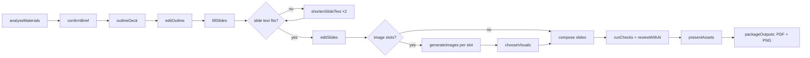

# Deck generation

**Status:** Target (draft for owner review) · **Updated:** 17 September 2026 · **Requirements:** COPY-4, COPY-5, VIS-2, ASSET-2, ASSET-8, TPL-4 · **Decisions:** D7, P6, P7, P8

How the `deck` recipe turns a brief into slides, renders them and delivers a PDF.

## Scope for the proof of concept

- Brand: MSD (P8), template set `msd-core-direction` (five layouts).
- 3 to 15 slides, 16:9.
- Output: PDF plus one PNG per slide (P6). No PPTX, no speaker notes.
- Visuals: AI-generated artwork or uploads for image slots (P7).

## Starting point in the code

`shared/msdPresentationTemplates.js` provides:

| Function | Purpose |
| --- | --- |
| `createMsdPresentationTemplates(sourceManifest)` | Five layouts on a 1280 × 720 `widescreen` canvas with 32 px safe areas, Arimo 400/700, MSD palette and logo |
| `presentationPlanContract({ templateGroupId, brief })` | AI schema to choose a layout per content moment (`slides[]` of `layoutId` and `content`) |
| `presentationAiContract(template)` | AI schema for one layout's text fields with character limits |
| `validatePresentationValues(template, values, measure)` | Rejects unknown fields, missing text, excess characters or lines, changed page or stage numbers; checks word width and wrapped lines when given a `measure` function |

Layouts and limits (characters / lines):

| Layout | Purpose | Text fields | Image slot |
| --- | --- | --- | --- |
| `msd-slide-opening` | Opening statement | `headline` 48/3, `body` 95/2, `footer` 65/1, `page` 3/1 | yes |
| `msd-slide-editorial` | Story and context | `headline` 48/3, `body` 155/4, `caption` 80/2, `footer` 65/1, `page` 3/1 | yes |
| `msd-slide-evidence` | Key numbers | `headline` 40/2, `insight` 66/3, `value1–3` 7/1, `label1–3` 65/2, `source` 110/1, `footer` 65/1, `page` 3/1 | no |
| `msd-slide-roadmap` | Four stages | `headline` 36/1, `stage1–4` 2/1, `title1–4` 25/2, `body1–4` 76/3, `footer` 65/1, `page` 3/1 | no |
| `msd-slide-closing` | Closing and next step | `headline` 45/3, `nextStep` 52/1, `contact` 75/1 | yes |

Nothing calls these from a service today; there is no deck renderer or PDF export.

## Pipeline

### 1. Outline (`outlineDeck`)

- **Input:** confirmed brief (summary, audience, goal, found copy, source excerpts), slide count, wording fidelity, template set with each layout's `purpose` and field list, brand voice summary and claims policy.
- **Contract:** `presentationPlanContract`, tightened: exactly `slideCount` slides; `layoutId` from the set; `content` becomes `message` (≤ 200 characters: the point of the slide) plus `sourceRefs` (IDs of brief source blocks used).
- **Rules** (in guidance and validation): the first slide uses the opening layout and the last the closing layout; evidence layouts only when the materials contain numbers; roadmap only for sequences of exactly four steps.
- **Validation (`outlineValid`):** count, known layouts, first and last layout rules, no empty messages.

### 2. Edit outline (`editOutline`)

The requester reorders, adds, removes and changes layouts. Edits are saved as an outline revision. Changing the outline marks slide text for changed slides stale.

### 3. Slide text (`fillSlides`)

- One generation job per slide (parallel, bounded), using `presentationAiContract(layout)` with brand voice, required lines and forbidden terms.
- **Wording fidelity:** `verbatim` copies source wording and only splits it into fields; `edit` tightens wording; `rethink` rewrites for the audience. Numbers, sources and contact details are never invented in any mode.
- Fixed fields (`page`, `stage1–4`) are set by composition from slide position and roadmap order, never by AI.
- **Validation (`slideTextValid`):** `validatePresentationValues` with a **server-side `measure`** built from the renderer's font layout (fontkit with the resolved brand fonts), so the check matches rendering exactly.
- **Repair:** `shortenSlideText` up to two attempts per failing slide; remaining failures are shown on the slide for manual editing.

### 4. Edit slides (`editSlides`)

Per-slide fields with counters and a fit indicator from the same `measure` function (exposed through an API endpoint so the browser does not guess).

### 5. Artwork

For each slide with an image slot, generate one image (guidance: imagery style, slide message, no text or logos, safe space where the layout places text) or accept an upload of at least 1280 × 720 and at most 8 MB. Failed images keep the others.

### 6. Compose and render

- Slides are template outputs of kind `slide` ([template model](template-model.md)).
- The renderer composes each slide at **2560 × 1440** (2× the canvas) for crisp PDF pages; a second 1280 × 720 PNG is produced for previews.
- Checks: `textFits`, `requiredWording` (MSD required lines on the closing slide or every slide, per brand `placement`), `forbiddenTerms`, `logoSafeArea`, `contrast`, `imageResolution`, `slideCount`, `fileIntegrity`; AI review in shadow mode.

### 7. PDF

- Assemble one page per slide from the 2× PNGs, page size 16:9 (338.67 × 190.5 mm), in outline order.
- Add document metadata: title, brand, flow ID, created date.
- Library: a pure JavaScript PDF writer (recommended: `pdf-lib`) running in the server process. Adding the dependency is part of M3.
- Text in the PDF is raster for the proof of concept. Selectable text and PPTX are later options (P6).

### 8. Package

`deck.pdf`, `slides/01.png` … and `manifest.json` ([quality and escalation](quality-and-escalation.md#packaging-and-delivery)). All slides must be accepted before download.

## Escalation for decks

The Figma package already accepts any scene size up to 16,384 px and up to 100 outputs, so slides import as frames in order. Returned frames replace slide revisions; the PDF is rebuilt from accepted revisions.

## Data

| Record | Content |
| --- | --- |
| Outline revision | Ordered slides: position, layout template version, message, source references |
| Slide text | Per slide: slot values, origin (`generated`, `edited`, `repaired`), outline revision |
| Slide output | Standard output record of kind `slide` with position |
| Package | PDF and PNG files, manifest |

## Template migration

The five layouts move from code into published `slide` templates with `set: msd-core-direction`, `brandScope: [MSD]`, a `purpose` text and role bindings ([template model](template-model.md#migration-from-today)). The existing manual presentation editor keeps working against the published templates.

## Risks

| Risk | Mitigation |
| --- | --- |
| Five layouts limit what decks can express | Outline guidance chooses the closest layout; measure layout usage and failure reasons in the pilot |
| Evidence and roadmap layouts need exact structures | Outline rules restrict when they are used |
| Dense source material exceeds limits | `rethink` fidelity default for long materials; shortening repair; manual editing |
| PDF size with 2× raster pages | PNG compression; measure a 15-slide deck; switch to 1.5× if above 20 MB |

## Acceptance

- A fixture brief produces a 7-slide MSD deck whose first slide is the opening layout and last is the closing layout.
- Every slide's text passes `slideTextValid` using the same measurement as rendering; a deliberately long headline is shortened or flagged, never truncated.
- Page numbers are correct after reordering slides.
- The downloaded PDF has one page per slide in order, and its manifest checksums match the files.
