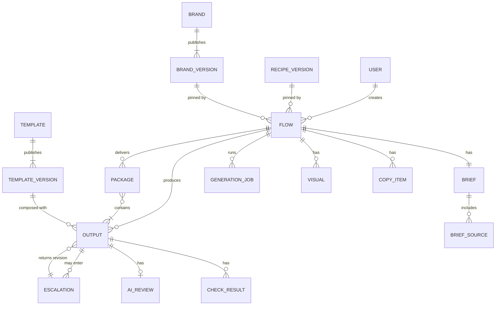
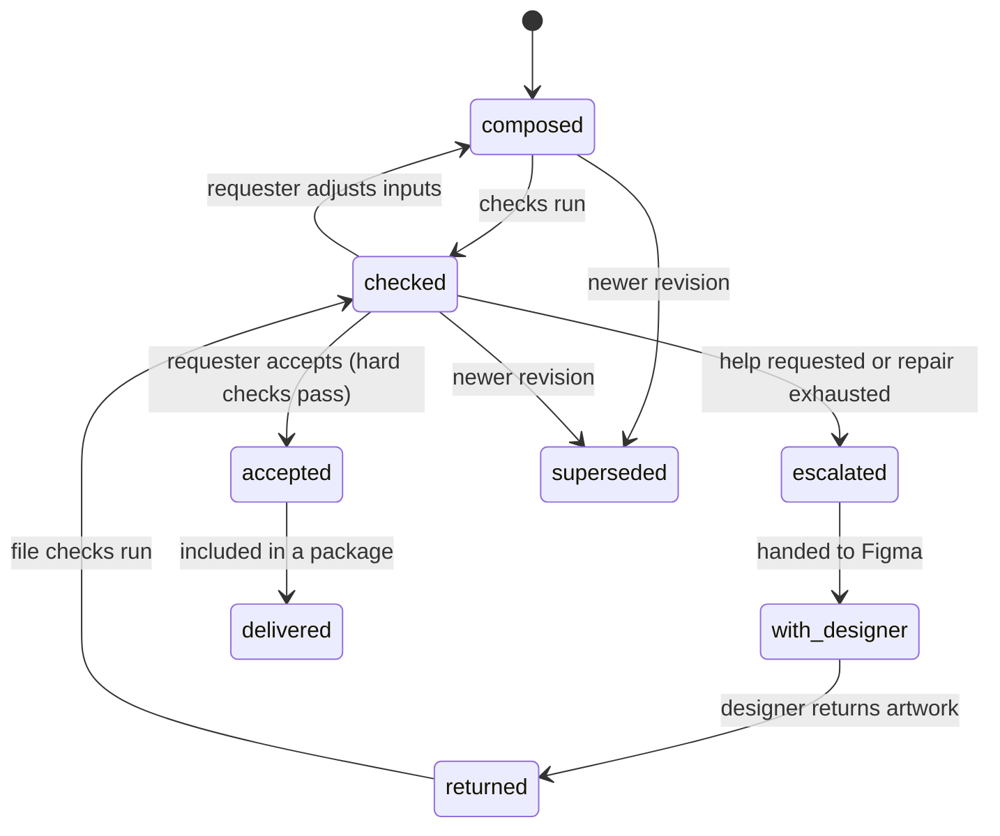

# Domain model

**Status:** Target (draft for owner review) · **Updated:** 17 September 2026 · **Requirements:** FLOW-2, FLOW-3, FLOW-7, FLOW-8, COPY-6, NFR-3, NFR-8

The records Automation Studio keeps, how they relate, how versions are pinned and how changes propagate. It evolves the existing database; the migration path is in [campaign migration](campaign-migration.md).

## Principles

1. **Pin what was used.** A flow records the exact brand, recipe and template versions it used. Published versions never change.
2. **Evolve, don't rewrite.** Existing tables keep their data and identifiers; new concepts are added beside them.
3. **The server decides.** Permissions, revisions, stale state and completion are computed and enforced on the server.
4. **Immutable outputs.** Accepted, returned and delivered outputs are never edited; changes create new revisions.

## Overview

## Entities

### User

Existing `users`. Roles stay `marketer` (shown as **requester**), `designer` and `admin`.

### Brand and brand version

Existing `brand_design_systems` and `brand_design_system_versions`. A brand has one editable draft and many published, immutable versions. The version snapshot gains the guidance fields in the [brand model](brand-model.md) (snapshot schema version 2).

### Template and template version

Existing `templates` (id + version + manifest). Extended by the [template model](template-model.md): asset type, template set, brand scope, brand-role bindings and content contract. Brand values are **not** stored in template versions; they are resolved at composition.

### Capability

Code, not data: an operation with a stable ID, version, input and output schemas, settings schema and standard recovery. The catalog is in [recipes](recipes.md#capability-catalog).

### Recipe version

Recipe files live in `recipes/<id>/`. When a flow first uses a recipe, the server stores the normalised recipe:

| Field | Meaning |
| --- | --- |
| `hash` | SHA-256 of canonical JSON (primary key) |
| `recipe_id`, `version` | From the file |
| `definition` | Normalised recipe, including resolved guidance text |
| `created_at` | First use |

### Asset creation flow

Evolves the existing `campaigns` table (see [campaign migration](campaign-migration.md)). Added fields:

| Field | Meaning |
| --- | --- |
| `asset_type` | `banners` or `presentations` (from the existing `project_type`) |
| `recipe_hash` | Pinned recipe version |
| `brand_version_id` | Pinned brand version |
| `stage_states` | Server-computed state per stage (below) |

Existing fields keep their meaning: `title`, `brief`, `revision`, `created_by`, `archived_at`, timestamps. The flow is the top-level record for the proof of concept (P9).

### Brief and brief sources

Existing `campaigns.brief` (briefing schema v2), `brief_sources` and `brief_confirmations`. A confirmation binds the analysis job, source key and answers; downstream generation requires a current confirmation (already enforced).

### Copy item

Existing `copy_sets` and candidates. Each item records its origin: `supplied` (imported verbatim from materials), `generated` (with its job) or `edited` (with an audit record of the change). For decks, copy items are slides: order, layout (template version) and slot values.

### Visual

Existing `visual_directions` and `assets`. A visual is a prompt plus a stored image (generated or uploaded) with provenance, linked to a copy item or to the whole flow.

### Generation job

Existing `generation_jobs`. Status `pending`, `succeeded`, `failed`, `blocked` or `unknown`.

**Change:** errors whose outcome is certain are recorded as `failed`. `unknown` is only for outcomes that may still complete (timeouts after dispatch, lost connections). Every `unknown` job has a resolution path: automatic reconciliation where the provider supports it, otherwise a user action **Mark as failed** that releases the flow. An `unknown` job older than its timeout plus a grace period is shown with that action.

### Output

A composed asset: one banner (copy × visual × template version × format) or one slide. Evolves existing `compositions` and banner batches.

| Field | Meaning |
| --- | --- |
| `id`, `flow_id`, `revision` | Identity; a new revision for every recomposition, repair or returned version |
| `kind` | `banner` or `slide` |
| `template_version`, `format` or slide position | What was composed |
| `inputs` | Copy item, visual and slot values used, with their revisions |
| `resolved_manifest_hash` | Template resolved with the pinned brand version |
| `file` | Rendered PNG with checksum |
| `origin` | `composed`, `repaired` or `returned` (from a designer) |
| `state` | See below |

### Check result and AI review

New. One check result per output revision and check: `check_id`, `passed`, `details`, `measured_at`. One AI review per output revision: rubric scores, overall score, concerns, model, cost, `mode` (`shadow` or `enforced`). See [quality and escalation](quality-and-escalation.md).

### Escalation

New, reusing existing `figma_handoffs`, `figma_plugin_sessions` and `figma_submissions` for the Figma round trip. Fields: reason, failed checks, output revisions, requester, designer, state, timestamps, returned output revisions.

### Package

Evolves existing `deliveries` and `delivery_builds`: an immutable set of accepted output revisions with files, a manifest and a checksum.

### Audit event

Existing `audit_events`. Adds: `output.accepted`, `escalation.created`, `escalation.returned`, `flow.brand_upgraded`, `flow.recipe_pinned`.

## States

### Stage states

Computed by the server for each stage of a flow.

| State | Meaning |
| --- | --- |
| `locked` | Prerequisites missing; the reason is provided |
| `ready` | Can be worked on; nothing produced yet |
| `in_progress` | Work exists or a job is running |
| `complete` | The stage's contract is satisfied |
| `stale` | Complete earlier, but an upstream input changed |

| Stage | Complete when |
| --- | --- |
| Brief | A current confirmation exists |
| Copy | At least one current selected copy item (banners) or a current outline with valid slide text (decks) |
| Visuals | Every selected copy item (banners) or image slot (decks) has a current visual |
| Assets | At least one output is accepted |

### Output states

`superseded` revisions stay readable for history.

## Change propagation

Dependencies are declared by capabilities and resolved by the server. A change marks dependent records `stale`; it never deletes them.

| Change | Becomes stale |
| --- | --- |
| Brief sources change | Analysis, confirmation, all later stages |
| Confirmed answers change (not visual keywords) | Generated copy, visuals and outputs derived from them; supplied copy stays |
| Visual keywords change only | Visuals and outputs using them; copy stays |
| Copy item edited | Visuals linked to that item; outputs using it |
| Visual replaced | Outputs using it |
| Brand upgraded (FLOW-8) | Copy, visuals and outputs generated with the old brand version |
| New template version published | Nothing in existing flows; new compositions may offer it |

Accepted and delivered outputs are never marked stale; they keep their recorded versions. A stale input shows a notice on outputs composed from it.

## Version pinning

| What | Pinned when | Changed by |
| --- | --- | --- |
| Recipe | Flow created | Never (a new flow uses the new recipe) |
| Brand version | Flow created | Explicit upgrade by the requester (FLOW-8) |
| Template version | Output composed | Recomposition offers the latest compatible version |
| Model and provider | Job created | Never for that job |

## Permissions

| Action | Requester | Designer | Admin |
| --- | --- | --- | --- |
| Create, edit, archive own flows | ✓ | | ✓ |
| Accept outputs, download packages | ✓ | | ✓ |
| Request design help | ✓ | | ✓ |
| Work on and return escalations | | ✓ | ✓ |
| Edit and publish brands and templates | | ✓ | ✓ |
| View any flow | | ✓ (escalated flows) | ✓ |
| Publish recipes | | | via repository |

Workspace scoping remains single-workspace for the proof of concept.

## Relationship to earlier proposals

The [admin and data model proposal](../engineering/proposals/admin-and-data-model.md) separates projects, documents, versions, runs and human tasks. For the proof of concept:

- the asset creation flow plays the role of both project and run (P9);
- outputs and packages play the role of document versions and files;
- escalations are the only human task type.

A later project grouping can hold several flows without changing flow records.
