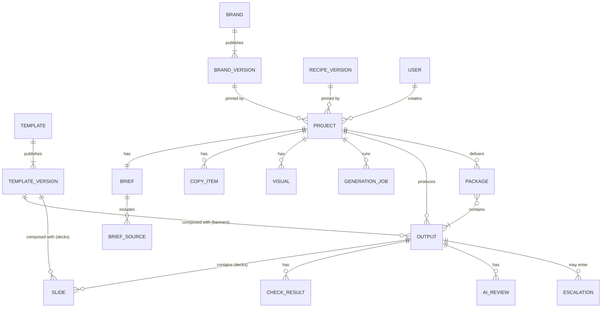
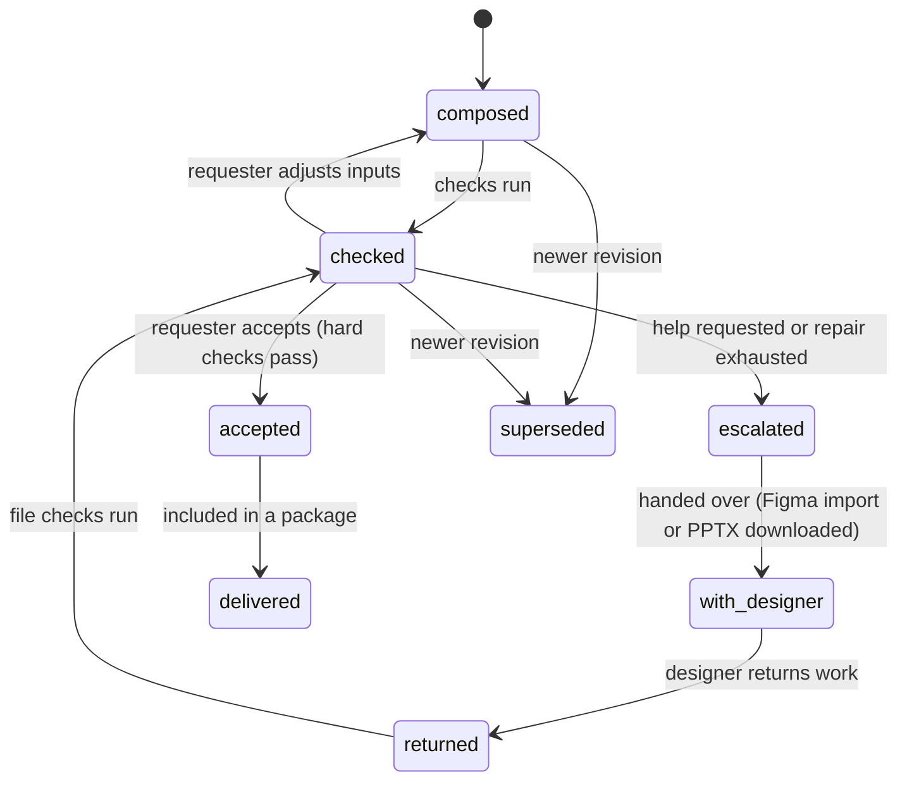

# Domain model

**Status:** Target (draft for owner review) · **Updated:** 17 September 2026 · **Requirements:** FLOW-2, FLOW-3, FLOW-7, FLOW-8, FLOW-10, COPY-6, NFR-3, NFR-8 · **Decisions:** D17–D19, D22, D23

The records Automation Studio keeps, how they relate, how versions are pinned and how changes propagate. It evolves the existing database; the migration path is in [campaign migration](campaign-migration.md).

## Principles

1. **Pin what was used.** A project records the exact brand, recipe and template versions it used. Published versions never change.
2. **Evolve, don't rewrite.** Existing tables keep their data and identifiers; new concepts are added beside them.
3. **The server decides.** Permissions, revisions, stale state and completion are computed and enforced on the server.
4. **Immutable deliverables.** Accepted, returned and delivered assets are never edited; changes create new revisions.

## Overview

## Entities

### User

Existing `users`. Roles stay `marketer` (shown as **requester**), `designer` and `admin`.

### Brand and brand version

Existing `brand_design_systems` and `brand_design_system_versions`. A brand has one editable draft and many published, immutable versions. The version snapshot gains the guidance fields and licensed font files in the [brand model](brand-model.md) (snapshot schema version 2).

### Template and template version

Existing `templates` (id + version + manifest). Extended by the [template model](template-model.md): output kind, template set, brand scope, brand-role bindings, image placeholders and content contract. Brand values are **not** stored in template versions; they are resolved at composition.

### Capability

Code, not data: an operation with a stable ID, version, input and output schemas, settings schema and standard recovery. The catalog is in [recipes](recipes.md#capability-catalog).

### Recipe version

Recipe files live in `recipes/<id>/`. When a project first uses a recipe, the server stores the normalised recipe:

| Field | Meaning |
| --- | --- |
| `hash` | SHA-256 of canonical JSON (primary key) |
| `recipe_id`, `version` | From the file |
| `definition` | Normalised recipe, including resolved guidance text |
| `created_at` | First use |

### Project

The top-level record ([D22](../product/decisions.md), [D23](../product/decisions.md)). Evolves the existing `campaigns` table (see [campaign migration](campaign-migration.md)). Added fields:

| Field | Meaning |
| --- | --- |
| `asset_type` | `banners` or `presentations`; fixed at creation |
| `recipe_hash` | Pinned recipe version |
| `brand_version_id` | Pinned brand version |
| `stage_states` | Server-computed state per stage (below) |

Existing fields keep their meaning: `title`, `brief`, `revision`, `created_by`, `archived_at`, timestamps.

**What a project delivers, by asset type:**

| Asset type | Outputs |
| --- | --- |
| `banners` | Any number of `banner` outputs |
| `presentations` | Exactly one `deck` output (with its slides) |
| `newsletters` (later) | Exactly one `newsletter` output |

The server rejects a second deck output in a deck project; recomposition creates a new revision of the same deck output.

### Brief and brief sources

Existing `campaigns.brief` (briefing schema v2), `brief_sources` and `brief_confirmations`. A confirmation binds the analysis job, source key and answers; downstream generation requires a current confirmation (already enforced).

### Copy item

Existing `copy_sets` and candidates for banners. Each item records its origin: `supplied` (imported verbatim from materials), `generated` (with its job) or `edited` (with an audit record of the change).

For decks, copy is the **outline** (ordered slides: position, layout template version, key message, source references) and **slide text** (slot values per slide, with origin `generated`, `edited` or `repaired`). Each outline change creates an outline revision.

### Visual

Existing `visual_directions` and `assets`, used by banner projects: a prompt plus a stored image (generated or uploaded) with provenance, linked to a copy item or to the whole project.

Deck projects have no visual records during the proof of concept: image slots show the placeholder defined in their slide template ([D19](../product/decisions.md)).

### Generation job

Existing `generation_jobs`. Status `pending`, `succeeded`, `failed`, `blocked` or `unknown`.

**Change:** errors whose outcome is certain are recorded as `failed`. `unknown` is only for outcomes that may still complete (timeouts after dispatch, lost connections). Every `unknown` job has a resolution path: automatic reconciliation where the provider supports it, otherwise a user action **Mark as failed** that releases the project. An `unknown` job older than its timeout plus a grace period is shown with that action.

### Output

A deliverable asset. Evolves existing `compositions` and banner batches.

| Field | Meaning |
| --- | --- |
| `id`, `project_id`, `revision` | Identity; a new revision for every recomposition, repair or returned version |
| `kind` | `banner` or `deck` |
| `origin` | `composed`, `repaired` or `returned` (from a designer) |
| `state` | See below |
| `file` | Banner: PNG. Deck: PPTX. With checksum |

**Banner outputs** also record the template version, format, copy item and visual (with revisions), text overrides from repair, and the resolved manifest hash.

**Deck outputs** also record the outline revision and their **slides**:

| Slide field | Meaning |
| --- | --- |
| `position` | Order in the deck |
| `template_version` | Slide layout used |
| `slot_values` | Text per slot, with origin |
| `resolved_manifest_hash` | Layout resolved with the pinned brand version |
| `preview` | PNG rendered for the application |

A returned deck revision (uploaded by the designer, [D18](../product/decisions.md)) contains the uploaded PPTX; its slides are not re-derived, and slide previews are shown when they can be extracted from the file.

### Check result and AI review

New. One check result per output revision and check, with an optional `slide_position` for deck checks: `check_id`, `passed`, `details`, `measured_at`. One AI review per banner revision or per slide of a deck revision: rubric scores, overall score, concerns, model, cost, `mode` (`shadow` or `enforced`). See [quality and escalation](quality-and-escalation.md).

### Escalation

New. Fields: reason, failed checks, output revisions, requester, designer, state, timestamps, returned output revisions.

| Asset type | Round trip records |
| --- | --- |
| Banners | Existing `figma_handoffs`, `figma_plugin_sessions` and `figma_submissions` |
| Decks | Download of the generated PPTX and upload of the returned PPTX (new `escalation_files`: direction, file, checksum, uploaded by, time) |

### Package

Evolves existing `deliveries` and `delivery_builds`: an immutable set of accepted output revisions with files, a manifest and a checksum. Banner packages contain PNG files; a deck package contains one PPTX file.

### Audit event

Existing `audit_events`. Adds: `output.accepted`, `escalation.created`, `escalation.returned`, `project.brand_upgraded`, `project.recipe_pinned`.

## States

### Stage states

Computed by the server for each stage of a project.

| State | Meaning |
| --- | --- |
| `locked` | Prerequisites missing; the reason is provided |
| `ready` | Can be worked on; nothing produced yet |
| `in_progress` | Work exists or a job is running |
| `complete` | The stage's contract is satisfied |
| `stale` | Complete earlier, but an upstream input changed |

| Stage | Complete when (banners) | Complete when (decks) |
| --- | --- | --- |
| Brief | A current confirmation exists | A current confirmation exists |
| Copy | At least one current selected copy item | A current outline with valid text for every slide |
| Visuals | Every selected copy item has a current visual | Always complete once Copy is complete (template placeholders) |
| Assets | At least one banner is accepted | The deck is accepted |

### Output states

A deck moves through these states as one output; its slide check results decide whether it can be accepted. `superseded` revisions stay readable for history.

## Change propagation

Dependencies are declared by capabilities and resolved by the server. A change marks dependent records `stale`; it never deletes them.

| Change | Becomes stale |
| --- | --- |
| Brief sources change | Analysis, confirmation, all later stages |
| Confirmed answers change (not visual keywords) | Generated copy, visuals and outputs derived from them; supplied copy stays |
| Visual keywords change only | Banner visuals and banner outputs using them; copy stays |
| Banner copy item edited | Visuals linked to that item; banner outputs using it |
| Banner visual replaced | Banner outputs using it |
| Deck outline changed | Slide text of changed slides; the deck output |
| Deck slide text edited | The deck output |
| Brand upgraded (FLOW-8) | Copy, visuals and outputs generated with the old brand version |
| New template version published | Nothing in existing projects; new compositions may offer it |

Accepted and delivered outputs are never marked stale; they keep their recorded versions. A stale input shows a notice on outputs composed from it.

## Version pinning

| What | Pinned when | Changed by |
| --- | --- | --- |
| Recipe | Project created | Never (a new project uses the new recipe) |
| Brand version | Project created | Explicit upgrade by the requester (FLOW-8) |
| Asset type | Project created | Never ([D22](../product/decisions.md)) |
| Template version | Output composed | Recomposition offers the latest compatible version |
| Model and provider | Job created | Never for that job |

## Permissions

| Action | Requester | Designer | Admin |
| --- | --- | --- | --- |
| Create, edit, archive own projects | ✓ | | ✓ |
| Accept outputs, download packages | ✓ | | ✓ |
| Request design help | ✓ | | ✓ |
| Work on and return escalations | | ✓ | ✓ |
| Edit and publish brands and templates | | ✓ | ✓ |
| View any project | | ✓ (escalated projects) | ✓ |
| Publish recipes | | | via repository |

Workspace scoping remains single-workspace for the proof of concept.

## Relationship to earlier proposals

The [admin and data model proposal](../engineering/proposals/admin-and-data-model.md) separates projects, documents, versions, runs and human tasks. For the proof of concept:

- the project is also the run: one creation flow per project ([D22](../product/decisions.md));
- outputs and packages play the role of document versions and files;
- escalations are the only human task type.

Grouping several projects, and reusing a brief across projects, are later work.
