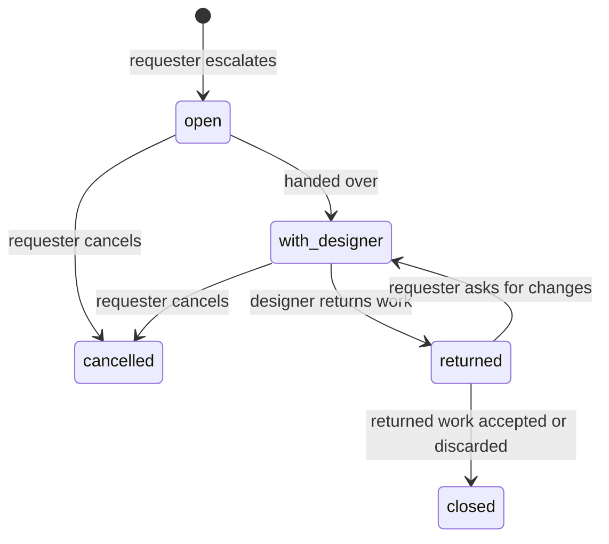

# Quality checks and escalation

**Status:** Target (draft for owner review) · **Updated:** 17 September 2026 · **Requirements:** ASSET-4–8, ESC-1–5, NFR-2, NFR-3, NFR-8 · **Decisions:** D1, D3, D17, D18, D28

How assets are checked and repaired, how requesters accept them, how work reaches a designer and comes back, and what is delivered.

## Principles

1. **Hard checks decide acceptability.** An asset that fails a hard check cannot be accepted.
2. **Repair before escalating,** within bounded attempts.
3. **AI review informs, it does not decide** during the pilot (shadow mode).
4. **Designers are an exception path,** entered with a clear reason.
5. **Evidence is stored** for every check, repair, review, escalation and acceptance.

## Check catalog

| Check | Applies to | Type | Passes when | Repair |
| --- | --- | --- | --- | --- |
| `textFits` | banner; each deck slide | hard | Every text slot fits `maxLines` at a size between `fontSize` and `minFontSize`, measured with the brand's rendering fonts; nothing truncated. Deck slides are measured with a 5% width margin for PowerPoint | `shortenCopy` (banners), `shortenSlideText` (slides) |
| `requiredWording` | banner; deck | hard | Every brand required line for the asset type is present verbatim where its `placement` requires; verbatim supplied copy is unchanged | none |
| `forbiddenTerms` | banner; each deck slide | hard | No brand forbidden term appears (case-insensitive, whole words and phrases) | `avoidTerms` |
| `logoSafeArea` | banner; each deck slide with a logo slot | hard | Logo present; rendered width ≥ `logoUsage.minWidthPx`; inside the safe area; clear space free of other slots; logo role allowed on its background | none |
| `contrast` | banner; each deck slide | hard | Text contrast ≥ 4.5:1, or ≥ 3:1 for text ≥ 24 px (≥ 18.66 px bold). Over solid backgrounds: colour roles. Over images: measured against the darkest and lightest 10% of pixels under the text box | none |
| `imageResolution` | banner | hard | Source image ≥ the slot's minimum dimensions | none |
| `outputSizes` | banner set | hard | Every requested template × format output exists with exact pixel dimensions | none |
| `slideCount` | deck | hard (composed) · advisory (returned) | Slide count equals the confirmed outline and the recipe bounds | none |
| `fileIntegrity` | banner; deck; package | hard | Banner PNG decodes with exact dimensions. Deck PPTX is a valid Office Open XML package with embedded images and only brand fonts referenced (fonts are advisory for returned decks). Checksums recorded | none |
| `language` | banner; deck | advisory | Detected text language equals the project language | none |

Advisory checks show a notice but never block acceptance.

Checks run after every composition, repair and returned revision. Each result stores `checkId`, `passed`, `details` (slot, measured values, missing lines, terms found), the output revision and, for decks, the slide position.

## Repair

| Action | What it does | Limits |
| --- | --- | --- |
| `shortenCopy` | Rewrites the failing banner slot text to fit, preserving meaning, voice and required words; the fit is measured, not estimated | Per banner; recipe `attempts` (≤ 3) |
| `shortenSlideText` | Same for deck slide text slots | Per slide |
| `avoidTerms` | Rewrites text to remove forbidden terms, using brand suggestions | 1 attempt |

- A banner repair stores its result as a **text override on that banner**, with origin `repaired`. The user's copy item is not changed, because the same copy may fit another template.
- A slide repair updates that slide's text with origin `repaired`, creating a new deck revision.
- Each attempt is a generation job with its own idempotency key and cost cap. No image regeneration happens automatically.
- When attempts are exhausted, the asset stays `checked` with failures, and design help is offered.
- A requester can apply a banner repair result to the original copy item explicitly.

## AI review

A new provider operation, `reviewOutput`, validated like other operations. It reviews one banner, or one deck slide preview at a time.

**Input:** rendered PNG; brand guidance subset ([brand model](brand-model.md#ai-context)); brief summary, audience and goal; template purpose; the text shown.

**Output (strict schema):**

| Field | Type |
| --- | --- |
| `scores.brandFit`, `scores.messageClarity`, `scores.visualQuality`, `scores.legibility`, `scores.appropriateness` | integer 1–5 |
| `overall` | integer 1–10 |
| `concerns` | up to 5 items, each ≤ 200 characters, each tagged with a dimension |

- **Mode `shadow`** (pilot): stored and shown as *AI review (experimental)*; never blocks acceptance or triggers escalation. For decks, the lowest slide score and its concerns are shown at deck level.
- **Mode `enforced`** (after the pilot): assets below `minScore` show a warning and trigger `aiReviewBelowMin` escalation offers. Whether they can still be accepted is an open question.
- Failures or timeouts store `unavailable` and never block.
- Cost is capped per call; there are no automatic retries.
- Agreement between the shadow score and the requester's decision is recorded for the pilot measure.

## Acceptance

| Asset type | Rule |
| --- | --- |
| Banner set | Each banner is accepted individually. Only the latest revision can be accepted, and only if every hard check passed on it. **Accept all ready** accepts every passing banner. |
| Deck | The deck is accepted as one asset. The latest composed revision can be accepted when every slide passes its hard checks and the PPTX passes `fileIntegrity`. A returned revision can be accepted when its file passes `fileIntegrity`. |

- Requesters (and admins) accept. Acceptance is recorded with user, time and revision, and is immutable.
- Accepted assets appear in the package list. Un-accepting is possible until the asset is delivered.

## Escalation

### Triggers

| Trigger | Behaviour |
| --- | --- |
| `hardCheckFailedAfterRepair` | The asset shows **Request design help** as the primary action, with the failed checks prefilled as the reason |
| `userRequested` | Any banner or the deck can be escalated with a reason |
| `aiReviewBelowMin` | Only when AI review is enforced |

### Record

| Field | Meaning |
| --- | --- |
| `id`, `project_id` | Identity |
| `outputs` | Banner revisions (one or more) or the deck revision |
| `reason` | Required text (≤ 1,000); prefilled for check failures |
| `failedChecks` | Snapshot of failing check results |
| `requestedBy`, `designer` | People; the pilot designer is Roman Kovbasyuk (D28) |
| `state` | See below |
| `route` | `figma` (banners) or `pptx` (decks) |
| `dueAt` | Created time plus one business day (D28) |
| timestamps | `createdAt`, `handedOffAt`, `returnedAt`, `closedAt` |

### States

*Handed over* means the Figma import receipt is verified (banners) or the designer has downloaded the PPTX (decks).

### Round trip — banners (Figma)

1. **Create.** The requester selects banners and gives a reason. They move to `escalated`.
2. **Hand off.** The system builds the Figma package from the banner revisions (existing `buildFigmaPackage`). The designer opens the Automation Studio plugin in the destination Figma file and imports; the import receipt is verified (existing receipts). State `with_designer`.
3. **Elevate.** The designer edits the frames in Figma.
4. **Return.** The designer submits from the plugin (existing `figma_submissions`). Each returned frame becomes a new banner revision with origin `returned`; `fileIntegrity` and dimension checks run. Content checks are not re-run on designer artwork.
5. **Decide.** The requester accepts returned banners or asks for changes with a comment (back to `with_designer`).

**Fallback (should, for the pilot):** if the plugin is unavailable, the designer downloads the composed banners and uploads returned PNGs mapped to banner IDs; the same checks and states apply.

### Round trip — decks (PPTX, D18)

1. **Create.** The requester escalates the deck with a reason. It moves to `escalated`.
2. **Hand off.** The designer downloads the generated PPTX from the escalation; the download is recorded. State `with_designer`.
3. **Elevate.** The designer improves the deck in PowerPoint or Keynote and exports PPTX.
4. **Return.** The designer uploads the improved PPTX. It becomes a new deck revision with origin `returned`. `fileIntegrity` is hard; slide count and non-brand fonts are advisory. Content checks are not re-run.
5. **Decide.** The requester downloads and reviews the returned deck, then accepts it or asks for changes with a comment.

Details are in [deck generation](deck-generation.md#escalation-for-decks-d18).

### Turnaround

Target: **one business day** from request to returned work (D28). Requesters see *With designer — expected by …*; overdue escalations are highlighted in the designer queue.

### Designer queue

Designers see open and in-progress escalations across projects: project title, brand, asset type, number of assets, reason, age, due time, route. They can open the project read-only, except for escalation actions.

## Packaging and delivery

A package contains accepted assets only.

| Asset type | Files |
| --- | --- |
| Banner set | One PNG per accepted banner: `<template>-<format>-<copy-label>.png` |
| Deck | One PPTX: `<project-title>.pptx` (D17) |

Every package includes `manifest.json`:

| Field | Meaning |
| --- | --- |
| `projectId`, `title`, `assetType` | Project identity |
| `brandVersionId`, `recipeHash` | Pinned versions |
| `outputs[]` | ID, revision, origin, file name, SHA-256, check summary, AI review overall score (if any), accepted by and at. Banners add template version, resolved manifest hash and format. Decks add slide count and per-slide template versions (for composed revisions) |
| `requiredFonts` | Decks: font families the PPTX references (for example Matter, Inter) |
| `createdAt`, `packageSha256` | Package identity |

Packages are immutable and rebuilt only as new packages (existing `deliveryService` hashing and recovery).

## Legacy review gate

The current gate (`composed → in_review → ready → approved → delivered` with a designer checklist and separate approver) is retired for projects using recipes. Campaigns already in review finish under the old rules ([campaign migration](campaign-migration.md)).

## Audit events

`output.checked`, `output.repaired`, `output.reviewed`, `output.accepted`, `output.unaccepted`, `escalation.created`, `escalation.handed_off`, `escalation.returned`, `escalation.changes_requested`, `escalation.cancelled`, `escalation.closed`, `package.created`.

## Acceptance

- A banner whose headline overflows is repaired at most twice; if it still fails, **Request design help** is offered and **Accept** is disabled with the reason.
- A brand forbidden term in generated copy fails `forbiddenTerms`, is rewritten once, and passes or is offered for escalation.
- A Figma escalation round trip creates returned banner revisions that the requester accepts and downloads.
- A PPTX escalation round trip creates a returned deck revision from the uploaded file that the requester accepts and downloads.
- AI review failures never block acceptance in shadow mode.
- The package manifest reproduces every file checksum and version reference.
