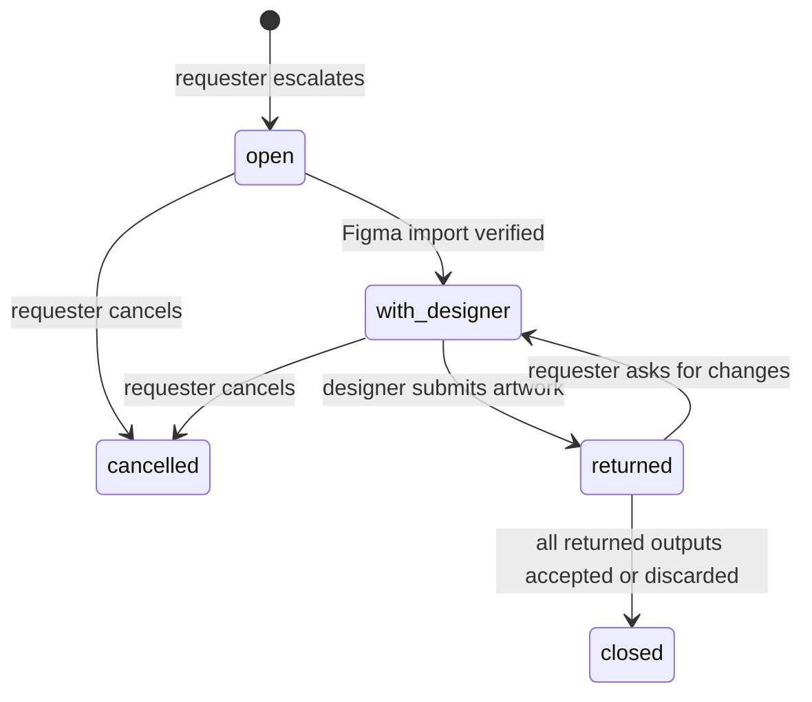

# Quality checks and escalation

**Status:** Target (draft for owner review) · **Updated:** 17 September 2026 · **Requirements:** ASSET-4–8, ESC-1–5, NFR-2, NFR-3, NFR-8 · **Decisions:** D1, D3

How outputs are checked and repaired, how requesters accept them, how work reaches a designer and comes back, and what is delivered.

## Principles

1. **Hard checks decide acceptability.** An output that fails a hard check cannot be accepted.
2. **Repair before escalating,** within bounded attempts.
3. **AI review informs, it does not decide** during the pilot (shadow mode).
4. **Designers are an exception path,** entered with a clear reason.
5. **Evidence is stored** for every check, repair, review, escalation and acceptance.

## Check catalog

| Check | Applies to | Type | Passes when | Repair |
| --- | --- | --- | --- | --- |
| `textFits` | banner, slide | hard | Every text slot fits `maxLines` at a size between `fontSize` and `minFontSize`, measured with the rendering fonts; nothing truncated | `shortenCopy` (banners), `shortenSlideText` (slides) |
| `requiredWording` | banner, slide | hard | Every brand required line for the asset type is present verbatim where its `placement` requires; verbatim supplied copy is unchanged | none |
| `forbiddenTerms` | banner, slide | hard | No brand forbidden term appears (case-insensitive, whole words and phrases) | `avoidTerms` |
| `logoSafeArea` | banner, slide | hard | Logo present where the template has a logo slot; rendered width ≥ `logoUsage.minWidthPx`; inside the safe area; clear space free of other slots; logo role allowed on its background | none |
| `contrast` | banner, slide | hard | Text contrast ≥ 4.5:1, or ≥ 3:1 for text ≥ 24 px (≥ 18.66 px bold). Over solid backgrounds: colour roles. Over images: measured against the darkest and lightest 10% of pixels under the text box | none |
| `imageResolution` | banner, slide | hard | Source image ≥ the slot's minimum dimensions | none |
| `outputSizes` | banner | hard | Every requested template × format output exists with exact pixel dimensions | none |
| `slideCount` | slide | hard | Slide count equals the confirmed outline and the recipe bounds | none |
| `fileIntegrity` | banner, slide, package | hard | Files decode, dimensions match, checksums recorded | none |
| `language` | banner, slide | advisory | Detected text language equals the flow language | none |

Advisory checks show a notice but never block acceptance.

Checks run after every composition, repair and returned revision. Each result stores `checkId`, `passed`, `details` (slot, measured values, missing lines, terms found) and the output revision.

## Repair

| Action | What it does | Limits |
| --- | --- | --- |
| `shortenCopy` | Rewrites the failing banner slot text to fit, preserving meaning, voice and required words; the fit is measured, not estimated | Per output; recipe `attempts` (≤ 3) |
| `shortenSlideText` | Same for slide text slots | Per slide |
| `avoidTerms` | Rewrites text to remove forbidden terms, using brand suggestions | 1 attempt |

- A repair stores its result as a **text override on that output**, with origin `repaired`. The user's copy item is not changed, because the same copy may fit another template.
- Each attempt is a generation job with its own idempotency key and cost cap. No image regeneration happens automatically.
- When attempts are exhausted, the output stays `checked` with failures, and design help is offered.
- A requester can apply a repair result to the original copy item explicitly.

## AI review

A new provider operation, `reviewOutput`, validated like other operations.

**Input:** rendered PNG; brand guidance subset ([brand model](brand-model.md#ai-context)); brief summary, audience and goal; template purpose; the output's text.

**Output (strict schema):**

| Field | Type |
| --- | --- |
| `scores.brandFit`, `scores.messageClarity`, `scores.visualQuality`, `scores.legibility`, `scores.appropriateness` | integer 1–5 |
| `overall` | integer 1–10 |
| `concerns` | up to 5 items, each ≤ 200 characters, each tagged with a dimension |

- **Mode `shadow`** (pilot): stored and shown as *AI review (experimental)*; never blocks acceptance or triggers escalation.
- **Mode `enforced`** (after the pilot): outputs below `minScore` show a warning and trigger `aiReviewBelowMin` escalation offers. Whether they can still be accepted is an open question.
- Failures or timeouts store `unavailable` and never block.
- Cost is capped per call; there are no automatic retries.
- Agreement between the shadow score and the requester's decision is recorded for the pilot measure.

## Acceptance

- Only the **latest revision** of an output can be accepted, and only if every hard check passed on that revision.
- Requesters (and admins) accept one output or **Accept all passing**.
- Acceptance is recorded with user, time and revision, and is immutable.
- Accepted outputs appear in the package list. Un-accepting is possible until the output is delivered.

## Escalation

### Triggers

| Trigger | Behaviour |
| --- | --- |
| `hardCheckFailedAfterRepair` | The output shows **Request design help** as the primary action, with the failed checks prefilled as the reason |
| `userRequested` | Any output (passing or failing) can be escalated with a reason |
| `aiReviewBelowMin` | Only when AI review is enforced |

### Record

| Field | Meaning |
| --- | --- |
| `id`, `flow_id` | Identity |
| `outputs` | Output revisions included (one or more from the same flow) |
| `reason` | Required text (≤ 1,000); prefilled for check failures |
| `failedChecks` | Snapshot of failing check results |
| `requestedBy`, `designer` | People |
| `state` | See below |
| `figmaHandoffId`, `figmaSubmissionId` | Existing Figma records |
| `dueAt` | Created time plus target turnaround |
| timestamps | `createdAt`, `handedOffAt`, `returnedAt`, `closedAt` |

### States

### Round trip

1. **Create.** The requester selects outputs and gives a reason. The outputs move to `escalated`.
2. **Hand off.** The system builds the Figma package from the output revisions (existing `buildFigmaPackage`). The designer opens the Automation Studio plugin in the destination Figma file and imports; the import receipt is verified (existing receipts). State `with_designer`.
3. **Elevate.** The designer edits the frames in Figma.
4. **Return.** The designer submits from the plugin (existing `figma_submissions`). Each returned frame becomes a new output revision with origin `returned`; `fileIntegrity` and dimension checks run. Content checks are not re-run on designer artwork; the designer is accountable for it.
5. **Decide.** The requester accepts returned outputs or asks for changes with a comment (back to `with_designer`).

**Fallback (should, for the pilot):** if the plugin is unavailable, the designer downloads the escalation package and uploads returned PNGs mapped to output IDs; the same checks and states apply.

### Turnaround

The pilot target is one business day (assumption until the pilot designer is named). Requesters see *With designer — expected by …*; overdue escalations are highlighted in the designer queue.

### Designer queue

Designers see open and in-progress escalations across flows: flow title, brand, asset type, number of outputs, reason, age, due time. They can open the flow read-only, except for escalation actions.

## Packaging and delivery

A package contains accepted outputs only.

| Asset type | Files |
| --- | --- |
| Banner set | One PNG per accepted output: `<template>-<format>-<copy-label>.png` |
| Deck | `deck.pdf` and `slides/NN.png` for accepted slides; the deck package requires every slide to be accepted |

Every package includes `manifest.json`:

| Field | Meaning |
| --- | --- |
| `flowId`, `title`, `assetType` | Flow identity |
| `brandVersionId`, `recipeHash` | Pinned versions |
| `outputs[]` | ID, revision, origin, template version, resolved manifest hash, format or slide number, file name, SHA-256, check summary, AI review overall score (if any), accepted by and at |
| `createdAt`, `packageSha256` | Package identity |

Packages are immutable and rebuilt only as new packages (existing `deliveryService` hashing and recovery).

## Legacy review gate

The current gate (`composed → in_review → ready → approved → delivered` with a designer checklist and separate approver) is retired for flows using recipes. Campaigns already in review finish under the old rules ([campaign migration](campaign-migration.md)).

## Audit events

`output.checked`, `output.repaired`, `output.reviewed`, `output.accepted`, `output.unaccepted`, `escalation.created`, `escalation.handed_off`, `escalation.returned`, `escalation.changes_requested`, `escalation.cancelled`, `escalation.closed`, `package.created`.

## Acceptance

- A banner whose headline overflows is repaired at most twice; if it still fails, **Request design help** is offered and **Accept** is disabled with the reason.
- A brand forbidden term in generated copy fails `forbiddenTerms`, is rewritten once, and passes or is offered for escalation.
- An escalation round trip through the Figma plugin creates returned revisions that the requester accepts and downloads.
- AI review failures never block acceptance in shadow mode.
- The package manifest reproduces every file checksum and version reference.
